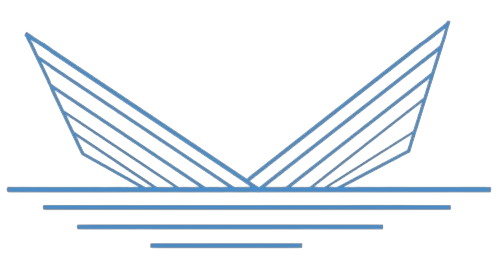
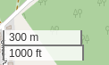
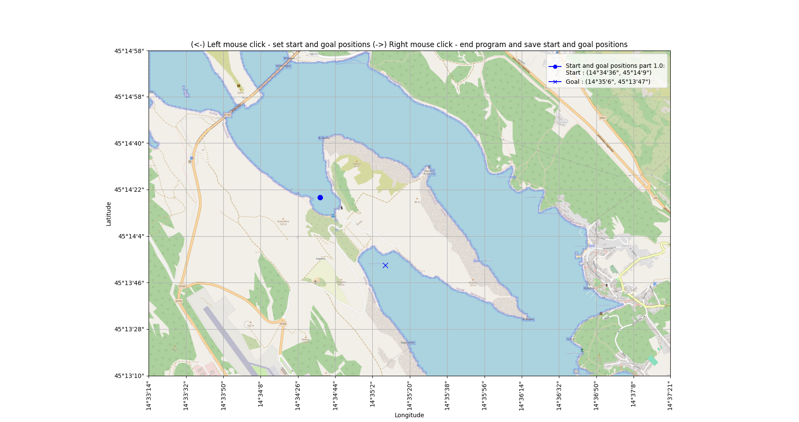

# Model-informed path-planning and control for autonomous vessels

#### Branch : `algorithms_test` 

# Path-planning algorithms performance test


<p align="center">

</p>

## Project description
This repository is a part of the diploma thesis at the Faculty of [Electrical Engineering and Computing, University of Zagreb](https://www.fer.unizg.hr/), [Laboratory for Underwater Systems and Technologies](https://labust.fer.hr/). The main goal of the thesis is to develop a _model-informed path planning and control for autonomous vessels (Croatian: Modelski informirano globalno planiranje putanje i upravljanje autonomnoga plovila)_.  The project is based on the PythonRobotics repository and it is used for educational purposes only.
 Model-informed path planning consists of the following steps:
 
1. `Data extraction and processing from OpenStreetMap`
2. `Testing of the path planning algorithms from the PythonRobotics repository on the extracted OpenStreetMap data`
3. Cost map generation
4. Testing of the path planning algorithms on the generated cost map
5. Path interpolation and optimization
6. Publishing data to the ROS2 environment and testing the path planning algorithms on the real vessel or in the simulation environment

`algorithms_test` branch is based on steps 1 & 2 and it is used for testing path-planning algorithms from the PythonRobotics repository and comparing the results in order to choose the best path-planning algorithm for the further steps.


## Table of Contents

   * [Installing](#installing)
   * [Requirements](#requirements)
   * [Executing program](#executing-program)
        * [Folder structure](#folder-structure)
        * [Step 1 : Download and processing data from OpenStreetMap](#step-1--download-and-processing-data-from-openstreetmap)
        * [Step 2 : Path planning algorithms testing](#step-3--path-planning-algorithms-testing)
       
  * [Credits](#credits)
  * [Acknowledgments](#acknowledgments)


## Installing
```terminal
git clone https://github.com/kr1zzo/Model-informed-path-planning.git
```

## Requirements

```terminal
pip install -r requirements/requirements.txt
```

## Executing program

Run the following command to test path-planning algorithms:

```terminal
python3 test_main.py
```


### Folder structure

```terminal
Model-informed-path-planning
    ├── assets
    │   └── ...
    ├── input_data            # Step 1
    │   └── ...
    ├── osm_data_processing   # Step 1
    │   └── ...
    ├── test_algorithm        # Step 2
    │   └── ...
    ├── results
    │   └── ...
    ├── requirements
    │   └── requirements.txt
    ├── test_main.py
    ├── config.yaml
    ├── README.md
    ├── .gitignore
    └── ...
```

* Steps are marked in `config.yaml` file with `## Step n : ...` and can be changed according to the user's needs.

* After [first run](#2.2.-Run-the-following-command-to-generate-map-and-detect-the-coastline), the `binary_dump` folders is created for saving the results and binary files for the path planning algorithms

## Step 1 : Download and processing data from OpenStreetMap


### 1.1. Download data from OpenStreetMap

`Folder name : input_data`

**Step 1.1. is optional and can be skipped if the default data is used. Feel free to download your data from OpenStreetMap and follow the instructions below!**

In the folder `input_data` are provided default data for the following locations:
- Voz, island of Krk, Croatia


#### 1.1.1. Go to [OpenStreetMap](https://www.openstreetmap.org/#map=15/45.2359/14.5844) and select the area you want to download

`Note: zoom should be 300 m / 1000 ft or less due to the image processing restrictions`

<p align="center">

</p>
<p align="center">
<em>
Figure 1: Zoom level on OpenStreetMap
</em>
</p>

#### 1.1.2. Make new folder `geolocation_name` (for example `Rijeka`) in the `input_data` folder and put `osm_data.txt` file inside

#### 1.1.3. Click on the Download button and download the data in .png format

<p align="center">

</p>
<p align="center">
<em>
Figure 2: Download data from OpenStreetMap
</em>
</p>


#### 1.1.4. Copy the downloaded .png file to the `input_data/geolocation_name` folder as `geolocation_name.png`

#### 1.1.5. Copy  HTML string from the OpenStreetMap website and paste it into the `input_data/geolocation_name` folder in the `osm_data.txt` file for extraction of the coordinates

<p align="center">

</p>
<p align="center">
<em>
Figure 3: Copy HTML string from OpenStreetMap
</em>
</p>

<br/>


#### 1.1.6. Update config.yaml file

Example of the config.yaml file for the `geolocation_name = voz`:

 ```yaml
## Step 1.1: Download data from OpenStreetMap (optional)
# Process OSM data
location_folder : "voz"
```
#### 1.1.7. Check the results

**Folder `input_data` should have the following structure:**

```terminal
    input_data
    ├── voz                  
    │   ├── osm_input.txt       # HTML string from the OpenStreetMa
    │   └── voz.png             # .png file from the OpenStreetMap
    ├── geolocation_name_1
    │   ├── osm_input.txt       # HTML string from the OpenStreetMa
    │   └── geolocation_name_1.png # .png file from the OpenStreetMap
    └── ...

```
* geolocation_1, geolocation_2, ..., location_n are the names of the locations added by the user in the previous steps


### 1.2 : Data extraction and processing from OpenStreetMap

**In this step, the OpenStreetMap data is processed and the map is resized to 1 pixel per 1 meter. Coastline is detected and start and goal points are set on the map.**

`Folder name: osm_data_processing`

```terminal
  osm_data_processing
    ├── detect_coast.py
    ├── process_osm_data.py
    ├── set_start_goal.py
    ├── test_results_visualization.py
    └── main.py
```

* `main.py` - main file for detecting coastline and setting start and goal points on the map. Results are saved in the `binary_dump` folder for further steps 
  


#### 1.2.1. Update config.yaml file

* Set `custom_start_goal` to `True` if you want to choose the start and goal points with a mouse click on the map or `False` if you want to add start and goal points manually in the config.yaml file
    * If `custom_start_goal` is set to `False`, set the `start_latitude`, `start_longitude`, `goal_latitude`, and `goal_longitude` in the config.yaml file. You can get the coordinates from the [OpenStreetMap](https://www.openstreetmap.org/#map=15/45.2300/14.5868), [Google Maps](https://www.google.com/maps/@45.2353117,14.5923406,14.61z?entry=ttu), etc.


The example of the config.yaml file for the location `voz`:
```yaml
## Step 1.2. : Data extraction and processing from OpenStreetMap 
custom_start_goal : False

# This is hardcoded start and goal position and applied only if custom_start_goal is False
start_latitude : 45.234781
start_longitude: 14.577538

goal_latitude : 45.230241
goal_longitude: 14.583173
```


If `custom_start_goal` is set to `True`, left click on the map to set the start and goal points. Right click to save the results. Else the start and goal points are set according to the `config.yaml` file and the map is displayed with the start and goal points. Exit displayed map with to save the results.

#### 1.2.3. Check the results

* the map is resized to 1 $pixel$ per 1 $meter^2$
* coastline is marked with a light blue color
* the start is marked with a blue circle and the goal with a blue X
* axis are displayed in geographical coordinates in format dms (degrees, minutes, seconds)
* longitude and latitude representation of the start and goal points are displayed in legend
* geolocation data marked in the map should be the same as geolocation data in the [OpenStreetMap](https://www.openstreetmap.org/#map=15/45.2300/14.5868), [Google Maps](https://www.google.com/maps/@45.2353117,14.5923406,14.61z?entry=ttu), etc

**Example of the map with start and goal points hardcoded in the config.yaml file:**

<p align="center">

</p>
<p align="center">
<em>
Figure 3: Example of the map with start and goal points
</em>
</p>

## Step 2 : Path planning algorithms testing

**In this step, path planning algorithms are tested on the map with the start and goal points set in the previous step. This step is used for testing path planning algorithms from the PythonRobotics repository and comparing the results in order to choose the best path planning algorithm for the further steps in the `path_planning` branch!**

`Folder name: test_algorithms`

```terminal
  test_algorithms
    ├── algorithms
    │   ├── a_star.py
    │   ├── bidirectional_a_star.py
    │   ├── dijkstra.py
    │   ├── dstar.py
    │   ├── d_star_lite.py
    │   ├── breadth_first_search.py
    │   ├── bidirectional_breadth_first_search.py
    │   ├── depth_first_search.py
    │   └── greedy_best_first_search.py
    ├── algorithms_base.py
    ├── algorithms_test.py
    ├── path_results.py
    └── main.py
```

* `main.py` - main file for testing path planning algorithms and runs following files:
* `test.py` - file for testing path planning algorithms and runs the algorithms from the `algorithms` folder
* `algorithms_class.py` - class for path planning algorithms
* `plot.py` - file for plotting the results of the path planning algorithms on the map and table with the result runtime and path length in meters

### 3.1. Update config.yaml file

- Set `result_image` name for the map with the path planning algorithm results and table_name for the table with the runtime results and path length
- Set `grid_size` and `robot_radius` for the path planning algorithms, recommended values are boat length and width as grid size and robot radius as 1/2 of the boat length
- Set `thread_enable` if runtime results are not needed and thread_enable map if runtime results are needed for algorithm runtime comparison
  - `thread_enable : True` - overall runtime is lower, but runtime of each algorithm is higher
- Set the path planning algorithm you want to test in the `test_algorithm` variable
- Set the path planning algorithm you want to plot in the `plot_algorithm` variable


```yaml
## Step 3: Path planning algorithms testing

result_image : "voz_result.png"
table_name : "runtime_results.png"
result_image_name : "result_image.png"

grid_size : 10.0  # [m]
robot_radius : 5.0  # [m]

# thread_enable : True - thread for plotting map
# thread_enable map : False - for algorithm runtime calculation
thread_enable : False

test_algorithm :  #plot_algorithm
- "a_star"
- "bidirectional_a_star"
- "dijkstra"
- "d_star"
- "d_star_lite"
- "breadth_first_search"
- "bidirectional_breadth_first_search"
- "greedy_best_first_search"
```

### 3.2. Run the following command to test path-planning algorithms

Run for testing and plotting algorithms:
 ```terminal
  python3 main.py
```
Run for testing algorithms runtime:
 ```terminal
  python3 test.py
```
Run for plotting the results:
 ```terminal
  python3 plot.py
```


### 3.3. Check the results

* Results are saved in the `results` folder with the name `result_image` and `table_name`


<p align="center">


<p align="center">
<em>
Figure 4: Example of the map with the path planning algorithm results
</em>
</p>

<p align="center">


<p align="center">
<em>
Figure 5: Example of the table with the runtime results and path length
<em>
</p>


## Credits

#### [&copy; Faculty of Electrical Engineering and Computing, University of Zagreb, 2024](https://www.fer.unizg.hr/)

#### [&copy; Laboratory for Underwater Systems and Technologies (LABUST)](https://labust.fer.hr/)


&NewLine;

Contributors names and contact info

Author|GitHub | e-mail
| :--- | :---: | :---:
Enio Krizman  | [@kr1zzo](https://github.com/kr1zzo) | enio.krizman@fer.hr

Mentors | e-mail
| :--- | :---: 
Doc. Dr. Sc. Đula Nađ  | dula.nad@fer.hr
Dr. Sc. Nadir Kapetanović  | nadir.kapetanovi@fer.hr

## Acknowledgments

This repository is built using the following resources and it is used only for educational purposes:
* [PythonRobotics repository](https://github.com/AtsushiSakai/PythonRobotics)
* [PythonRobotics documentation](https://arxiv.org/abs/1808.10703)
