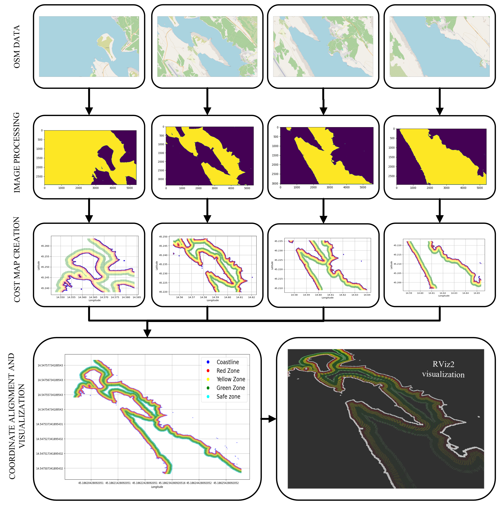

# Model-informed path planning and control for autonomous vessels


## Project description
This repository is a part of the diploma thesis at the Faculty of [Electrical Engineering and Computing, University of Zagreb](https://www.fer.unizg.hr/), [Laboratory for Underwater Systems and Technologies](https://labust.fer.hr/) in the acamedic year 2023./2024. The main goal of the thesis is to develop a _model-informed path planning and control for autonomous vessels (Croatian: Modelski informirano globalno planiranje putanje i upravljanje autonomnoga plovila)_.
# TODO : DETAILED DESCRIPTION OF THE PROJECT

## ROS2 commands

# map_maker package

## Introduction

## Introduction

To develop a global path planning system for vessels, the first step is creating a geographic map with hydrographic features. Nautical charts are typically used for this purpose, as they include essential details such as seafloor morphology, coastline coordinates, and navigation hazards. Due to the unavailability of digital nautical charts and other digital maps, custom programs were created to process data from OpenStreetMap, focusing on coastline coordinates and distances. Future project stages will incorporate additional hydrographic details, such as seafloor morphology and navigation hazards. This chapter outlines the map creation process, including data conversion and integration with the ROS2 framework.



## Running the map_maker Package

```sh
ros2 launch map_maker make_map_launch
```

Default values:
```sh
save_file_name:="jadranovo"

locations:='["sv_marko","voz","jadranovo", "kacjak", "rudine"]'

grid_size:="10"

show_plot:="False"
```

Example values:
```sh
save_file_name:="klimno"

locations:='["dramalj", "crikvenica", "selce", "rudine", "klimno", "silo", "petrina", "vodica" "melska"]'

grid_size:="10"

show_plot:="True"
```
## Running the path_planning_client Package

## Intraduction


## Running the path_planning_server Package

## Introduction

# 

## Credits

#### [&copy; Faculty of Electrical Engineering and Computing, University of Zagreb, 2024](https://www.fer.unizg.hr/)

#### [&copy; Laboratory for Underwater Systems and Technologies (LABUST)](https://labust.fer.hr/)


&NewLine;

Contributors names and contact info

Author|GitHub | e-mail
| :--- | :---: | :---:
Enio Krizman  | [@kr1zzo](https://github.com/kr1zzo) | enio.krizman@fer.hr

Mentors | e-mail
| :--- | :---: 
Doc. Dr. Sc. Đula Nađ  | dula.nad@fer.hr
Dr. Sc. Nadir Kapetanović  | nadir.kapetanovi@fer.hr

## Acknowledgments

This repository is built using the following resources and it is used only for educational purposes:
* [PythonRobotics repository](https://github.com/AtsushiSakai/PythonRobotics)
* [PythonRobotics documentation](https://arxiv.org/abs/1808.10703)
