# [Model-informed Path-Planning and Control for Autonomous Vessels](https://repozitorij.fer.unizg.hr/islandora/object/fer:12451)

*System Architecture and Implementation of Global Vessel Path Planning Based on ROS2 Framework*


<p align="center">
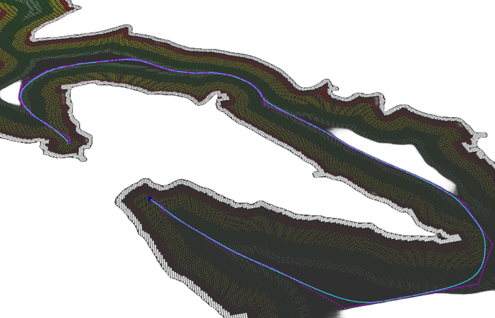
</p>

## 📚 Table of Contents

   * [Project Information](#-project-information)
   * [Installing](#-installing)
   * [Requirements](#-requirements)
   * [ROS2 Software Architecture for Vessel Path Planning](#-ros2-software-architecture-for-vessel-path-planning)
   * [`map_maker` Package](#️-map_maker-package)
      * [Map Creation](#1️⃣-map-creation---optional)
         * [Download data from OpenStreetMap](#download-data-from-openstreetmap)
         * 🔗 [ROS2 Commands for Map Creation](#-ros2-commands-for-map-creation)
         * 🔗 [ROS2 Commands for Cost Map Visualization](#-ros2-commands-for-cost-map-visualization)
      * [Map Publishing](#2️⃣-map-publishing)
         * 🔗 [ROS2 Commands for Map Publishing](#-ros2-commands-for-map-publishing)
  * [`path_planning_client` Package](#-path_planning_client-package)
      * [Cost Map Visualization](#1️⃣-cost-map-visualization)
         * 🔗 [ROS2 Commands for Cost Map Visualization in RViz2](#-ros2-commands-for-cost-map-visualization-in-rviz2)
      * [Setting Start and Goal Points](#2️⃣-setting-start-and-goal-points)
         * [Setting Start and Goal Points via Rviz2](#1-setting-start-and-goal-points-via-rviz2)
         * [Setting Start and Goal Points via Terminal](#2-setting-start-and-goal-points-via-terminal)
            * 🔗 [ROS2 Commands for Setting Start and Goal Points](#-ros2-commands-for-setting-start-and-goal-points)
      * [Publishing Start and Goal Points to the ROS2 Framework](#3️⃣-publishing-start-and-goal-points-to-the-ros2-framework)
         * 🔗 [ROS Commands for Publishing Start and Goal Points](#-ros-commands-for-publishing-start-and-goal-points)
  * [`path_planning_server` Package](#-path_planning_server-package)
     * 🔗 [ROS2 Command for Running Path Planning](#-ros2-command-for-running-path-planning)
  * 🔗 [Example](#-example)
  * [Credits](#-credits)
  * [Acknowledgments](#-acknowledgments)

### 🔗 Direct Links to ROS2 Commands
- [Map Creation](#-ros2-commands-for-map-creation)
- [Cost Map Visualization](#-ros2-commands-for-cost-map-visualization)
- [Map Publishing](#-ros2-commands-for-map-publishing)
- [Cost Map Visualization in RViz2](#-ros2-commands-for-cost-map-visualization-in-rviz2)
- [Setting Start and Goal Points](#-ros2-commands-for-setting-start-and-goal-points)
- [Publishing Start and Goal Points](#-ros-commands-for-publishing-start-and-goal-points)
- [Running Path Planning](#-ros2-command-for-running-path-planning)
- [Example](#-example)

&nbsp;

## ⚙️ Installing
```terminal
git clone https://github.com/kr1zzo-FER/Model-Informed-Path-Planning.git
```

## 📋 Requirements

```terminal
pip install -r requirements/requirements.txt
```
&nbsp;

## 💡 Project Information

**This repository is a part of the diploma thesis at the Faculty of [Electrical Engineering and Computing, University of Zagreb](https://www.fer.unizg.hr/), [Laboratory for Underwater Systems and Technologies](https://labust.fer.hr/) in the academic year 2023./2024. The main goal of the thesis is to develop a [_model-informed path planning and control for autonomous vessels (Croatian: Modelski informirano globalno planiranje putanje i upravljanje autonomnoga plovila)_](https://repozitorij.fer.unizg.hr/islandora/object/fer:12451). The goal of the project was to develop a modular software system architecture for global vessel path planning using the Robot Operating System 2 (ROS2) framework. The system is designed to be flexible and scalable, integrating OpenStreetMap data, RViz2 visualization tools, and advanced path planning algorithms. The architecture consists of three main stages: map creation, start-goal management, and path planning. Requirement of the project was to develop general path planning algorithm that can be used for any type of vessel. Thus, dynamic vessel model is not implemented in this project.**

**The `documentation` directory contains the final thesis and IEEE conference paper submissions, offering an in-depth description of the project. The paper is writen in English so it can be used as a reference for the project, while the thesis is written in Croatian and it is yet to be translated.**

&nbsp;

## 🤖 ROS2 Software Architecture for Vessel Path Planning

Project involves the development of a modular software system architecture for global vessel path planning using **[Robot Operating System 2 (ROS2), version : Iron](https://docs.ros.org/en/iron/index.html)**. The system is designed to be flexible and scalable, integrating OpenStreetMap data, RViz2 visualization tools, and advanced path planning algorithms. The architecture consists of three main stages, as outlined below.


<p align="center">

</p>
<p align="center">
<em>
Figure : Block diagram of the ROS2 system architecture for global vessel path planning
</em>
</p>

### Key Components

1. **Workspace: `path_planning_ws`**
   - Organized into standard ROS2 directories:
     - `src`: Contains core packages (`map_maker`, `path_planning_client`, `path_planning_server`, `user_action_interfaces`).
     - `build`, `install`, and `log`: Support package compilation, installation, and logging.

2. **Packages**
 - The system architecture is divided into three logical stages, with each stage implemented as a ROS2 package:
 - 1️⃣ [Map-Making Package map_maker](#️-map_maker-package)
   - **Purpose**: Extract geographic features from OpenStreetMap and create a cost map and publish data in ROS2 framework
   - **Implementation**: 
      - Makes map from OpenStreetMap data
      - Utilizes the Pseudo-Mercator projection (EPSG:3857).
      - Publishes cost maps via a ROS2 publisher.
   - **Output**: Cost maps for path planning.

 - 2️⃣ [Start-Goal Management Package `path_planning_client`](#-path_planning_client-package)
   - **Purpose**: Define start and goal coordinates using RViz2 or geographic data and data visualization in RViz2.
   - **Implementation**:
      - Employs the ROS2 action client-server mechanism for communication.
      - Converts and visualizes data for coordinate setup.
   - **Output**: Start and goal coordinates published within the ROS2 framework.

 - 3️⃣ [Path-Planning Package `path_planning_server`](#-path_planning_server-package)
   - **Purpose**: Generate a feasible and smooth path using the D* Lite algorithm.
   - **Implementation**:
      - Interpolates waypoints for enhanced path smoothness.
      - Exchanging data via the action client-server communication pattern.
   - **Output**: Interpolated paths for vessel navigation.

 - 4️⃣ [Custom Interfaces Package `user_action_interfaces`](#user_action_interfaces-package)

   - **Purpose**: Define custom messages and actions for efficient communication between ROS2 packages.
   - **Implementation**:
      - Provides standardized message types for inter-package data exchange.
      - Includes action definitions for start-goal updates, path planning requests, and feedback.
      - Ensures compatibility across all system components through well-defined interfaces.
   - **Output**: Custom message and action types for seamless communication within the ROS2 framework.


3. **Communication Mechanisms**
   -  📤 [Publisher-Subscriber](https://docs.ros.org/en/iron/Tutorials/Beginner-Client-Libraries/Writing-A-Simple-Py-Publisher-And-Subscriber.html)
      - Shares data such as Cost maps, Visualization data and Coordinate updates.

   - 📨 [Server-Client (Actions)](https://docs.ros.org/en/iron/Tutorials/Beginner-Client-Libraries/Writing-A-Simple-Py-Service-And-Client.html)
      - Manages path planning by:
         - Submitting start/goal coordinates via requests.
         - Providing raw and interpolated path information via feedback.


4. **Black-Box Concept**
   - Geographic data is converted between global and local systems during processing.
   - Ensures compatibility and modularity by exchanging data in global geographic coordinates, allowing seamless integration and upgrades.
   - This modular design supports real-world applications, enabling interoperability with external systems for visualization, navigation, and control.

&nbsp;

# 🗺️ map_maker Package

The **map_maker** ROS2 package is designed for creating and integrating geographical maps into the ROS2 framework. 
This package processes data to generate maps and publishes them using a ROS2 publisher. 
The workflow and associated programs are outlined below.

<p align="center">
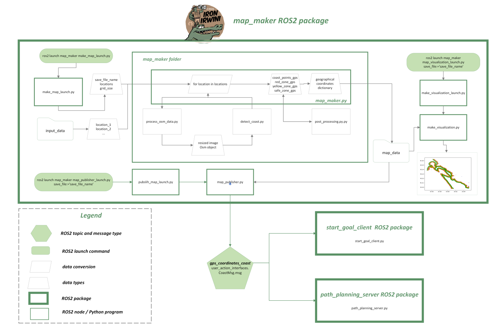
</p>
<p align="center">
<em>
Figure : map_maker Package Architecture
</p>

### Primary Objectives

1. **[Map Creation](#1️⃣-map-creation---optional)**
   - The package generates geographical maps by processing images and HTML data from OpenStreetMap stored in the `input_data` directory. 
   - The main script, `map_process.py`, coordinates this process by:
     - Initializing parameters from the `make_map_launch.py` file.
     - Iterating over `locations` directories in `input_data` to process map data.

2. **[Map Publishing](#2️⃣-map-publishing)**
   - The processed maps are saved in the `map_data` directory and published as ROS2 messages.
   - The `map_publisher.py` node converts processed map data into `CoastMsg.msg` format and broadcasts it via the `gps_coordinates_coast` topic.

&nbsp;

## 1️⃣ Map Creation - Optional


#### Directories : `input_data` → `map_maker` → `map_data`

- Map Creation involves extracting geographical data from OpenStreetMap provided in `input_data` directory and converting it into a cost map for path planning using programs from `map_maker` directory 
- Processed maps are saved in the `map_data` directory as binary files and published as ROS2 messages
- The process is outlined below and its consits of following steps:
   - **[Download data from OpenStreetMap](#download-data-from-openstreetmap)**
   - **[ROS2 Commands for Map Creation](#-ros2-commands-for-map-creation)**
   - **[ROS2 Commands for Cost Map Visualization](#-ros2-commands-for-cost-map-visualization)**

<p align="center">
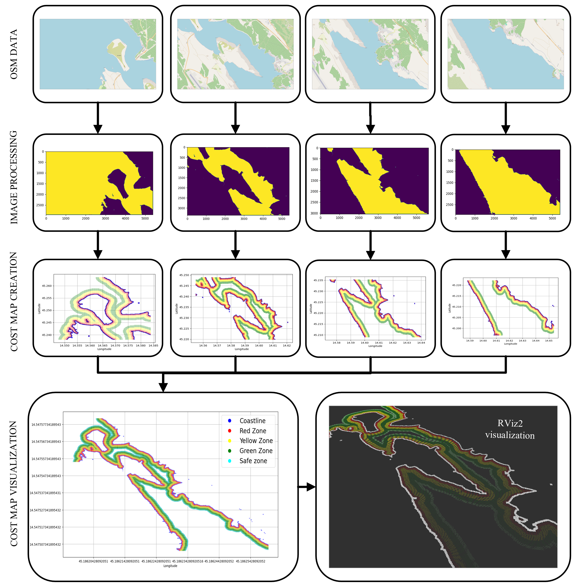
</p>
<p align="center">
<em>
Figure : Map Creation Process
</p>

### [Download data from OpenStreetMap](https://www.openstreetmap.org/#map=15/45.2359/14.5844)
---

#### Directories: `input_data`

1️⃣ *Create Geographic Area Folders*
- Navigate to the `input_data` folder in the ROS2 package `map_maker`.
- Create subfolders named after the geographic areas of interest (e.g., `jadranovo`).

2️⃣ *Download Map Data*
- Visit the [OpenStreetMap](https://www.openstreetmap.org/#map=15/45.2359/14.5844) website.
- Select the desired region and set the zoom level to **300 meters**.
- Download:
  - A `.png` image of the map (e.g., `jadranovo.png`) and save it in the respective folder.
  - The HTML share information:
      - Copy the "Share" HTML code.
      - Create a file named `osm_info.txt` in the same folder and paste the HTML code inside.

<p align="center">

</p>
<p align="center">
<em>
Figure : Download image from OpenStreetMap
</em>
</p>

<p align="center">

</p>
<p align="center">
<em>
Figure 2: Copy HTML string from OpenStreetMap
</em>
</p>


3️⃣ *Repeat the Process*
   - Repeat the process until you are satisified with selected region consisting of few **300 meters** zoom level images

### 📋 Notes
- For best results, use a zoom level of **300 meters**, as it preserves topographic details while maintaining manageable file sizes.
- Ensure all folders in `input_data` contain both the `.png` image and the `osm_info.txt` file.

&nbsp;


### 🚀 ROS2 Commands for Map Creation


#### Directories: `map_maker`, `map_data`

The following commands are used to create binary map files consisting of cost maps for path planning with geographical coordinates:

```sh
ros2 launch map_maker make_map_launch.py
```

If data is fetched from OpenStreetMap, the following command should be used:

```sh
ros2 launch map_maker make_map_launch.py parameter1_name:="parameter1_value" parameter2_name:="parameter2_value" ...
```

Available `parameter*_name` and their default values are:

```sh
save_file_name:="jadranovo"

locations:='["sv_marko","voz","jadranovo", "kacjak", "rudine"]' -> example of fetched data from OSM for default map

grid_size:="10"

show_plot:="True"
```

Where locations are the names of the folders in the `input_data` directory containing the map data.

If everything is did correctly, under directory `map_maker/map_data` processed map should be visible as binary file named `processed_map_*save_file_name*`

&nbsp;

### 🚀 ROS2 Commands for Cost Map Visualization

*You can test out the created map with the following command that runs `map_visualization.py` script:*

```sh
ros2 launch map_maker visualization_map_launch.py 
```

If you want to visualize a specific map, you can do so by running the following command with the desired map file name:

```sh
ros2 launch map_maker visualization_map_launch.py save_file:="save_file_name"
```
Previous command visualize the maps from the `map_data` directory. 
<p align="center">
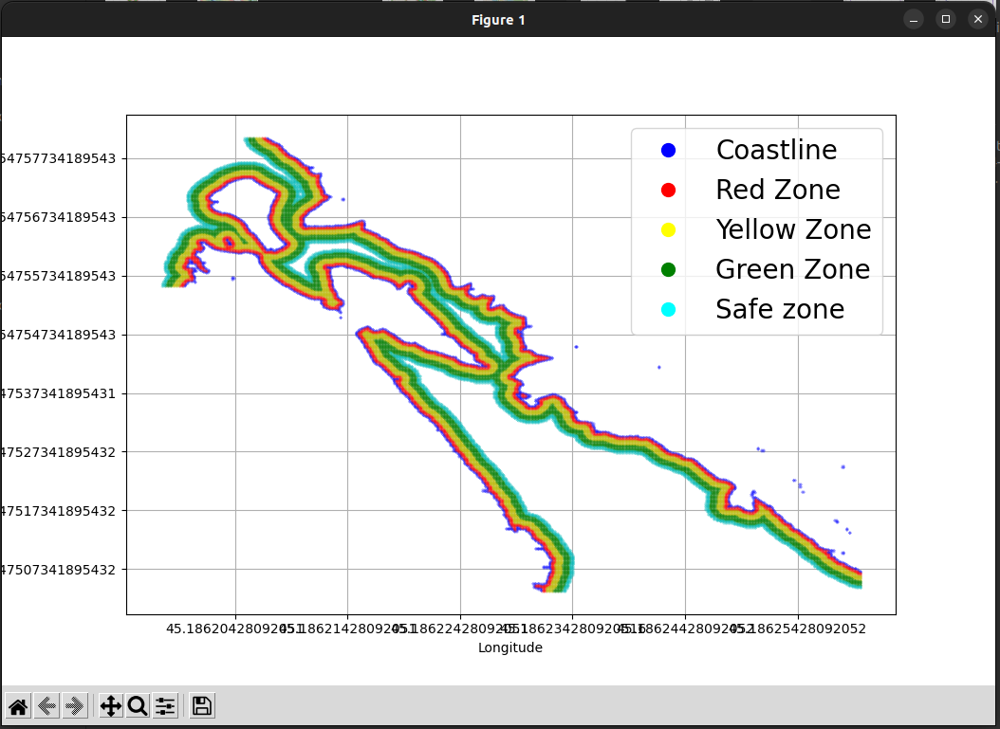
</p>
<p align="center">
<em>
Figure : Example of visualized map processed_map_jadranovo
</p>

&nbsp;

## 2️⃣ Map Publishing

#### Directories: `map_maker`, `map_data`

Geographic maps are stored as binary files (`processed_map_save_file_name`), defined in the launch file, and located in the `map_data` directory. These maps are published via the `map_publisher.py` node, which processes the data into `CoastMsg.msg` format for the ROS2 topic `gps_coordinates_coast`.

&nbsp;

###  🚀 ROS2 Commands for Map Publishing

To publish the generated map using the ROS2 publisher `gps_coordinates_coast`, execute the following command in the Linux terminal :

```bash  
ros2 launch map_maker publish_map_launch.py
```

If you want to publish a specific map, you can do so by running the following command with the desired map file name:
```bash
ros2 launch map_maker publish_map_launch.py save_file:='save_file_name'
```
#### The given map is [visualized in RViz2](#1️⃣-cost-map-visualization), described in the next section. The different maps can be visualized by changing the `save_file` parameter and re-run the command without the need to re-run the RViz2 visualization command.

&nbsp;

# 📡 path_planning_client Package

The **path_planning_client** ROS2 package is responsible for visualizing data in the RViz2 tool, managing the process of setting the start and goal points for vessel path planning, and publishing these points within the ROS2 framework using the action client and server communication mechanism. 
This package integrates tools for setting coordinates, visualizing planned paths, and managing the path planning and visualization process.

<p align="center">
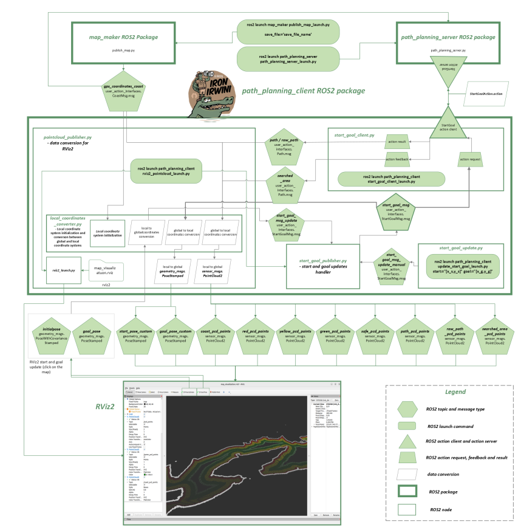
</p>
<p align="center">
<em>
Figure : path_planning_client Package Architecture
</p>

### Primary Objectives

1. **[Cost Map Visualization](#1️⃣-cost-map-visualization)** 
   - The `poincloud_publisher.py` node visualizes cost maps, search areas, and safe zones in RViz2.
   - Data is converted into ROS2 message formats (`sensor_msgs.PointCloud2`, `geometry_msgs.PoseStamped`) for seamless visualization.

1. **[Setting Start and Goal Points](#2️⃣-setting-start-and-goal-points)** 
   - Start and goal points are defined through the `start_goal_publisher.py` node, which interacts with RViz2 for visualization and accepts manual updates via the terminal.
   - These points are published on the `start_goal_msg` topic and converted into global coordinates for path planning.

2. **[Publishing Start and Goal Points to the ROS2 Framework](#3️⃣-publishing-start-and-goal-points-to-the-ros2-framework)**
   - The `start_goal_publisher.py` node publishes start and goal points on the `start_goal_msg` topic, enabling seamless communication between the client and server packages.

**Note:** Dependencies include the `map_maker` package for geographic coordinate data published via the `gps_coordinates_coast` topic.

&nbsp;

## 1️⃣ Cost Map Visualization

The RViz2 visualization tool is launched using the `rviz2_pointcloud_launch.py` launch file, which loads the prepared `map_visualization.rviz` configuration from the `rviz2` directory and initializes the `poincloud_publisher.py` node; it is executed with the command: `ros2 launch path_planning_client rviz2_pointcloud_launch.py`.

&nbsp;
### 🚀 ROS2 Commands for Cost Map Visualization in RViz2

To visualize cost maps, search areas, and safe zones in RViz2, first launch [ROS2 Commands Map Publishing](#-ros2-commands-for-map-publishing) and then
execute the following command in the Linux terminal:

```sh
ros2 launch path_planning_client rviz2_pointcloud_launch.py
```

<p align="center">
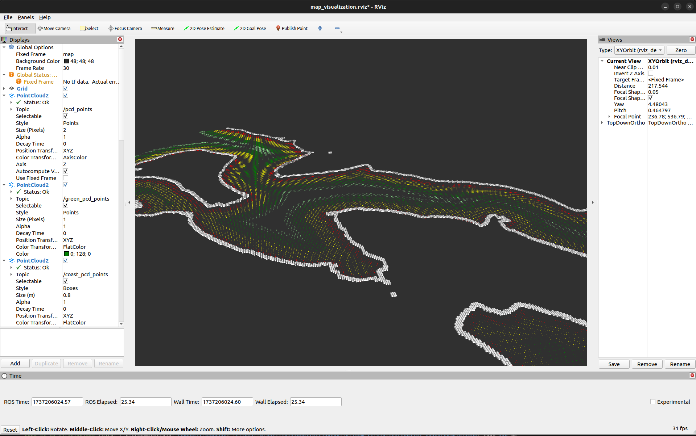
</p>
<p align="center">
<em>
Figure : RViz2 Visualization of Cost Map
</p>

&nbsp;

## 2️⃣ Setting Start and Goal Points


#### Directories: `path_planning_client`

There are two ways to set the start and goal points for path planning: manually via the terminal or using RViz2. The `start_goal_publisher.py` node is responsible for setting these points and publishing them on the `start_goal_msg` topic.

### 1. Setting Start and Goal Points via Rviz2

In Rviz2 you can use `2D Pose Estimate` and `2D Nav Goal` tools to set start and goal points by clicking on the map:

<p align="center">
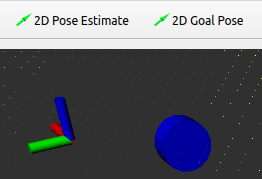
</p>
<p align="center">
<em>
Figure : Setting Start and Goal Points in RViz2
</p>

&nbsp;

### 2. Setting Start and Goal Points via Terminal

### 🚀 ROS2 Commands for Setting Start and Goal Points

To set start and goal points manually via the terminal, execute the following command in the Linux terminal:

Setting start point:
```sh
ros2 launch path_planning_client update_start_goal_launch.py
start:="[x_s,y_s]"
```
Setting goal point:
```sh
ros2 launch path_planning_client update_start_goal_launch.py
goal:="[x_g,y_g]"
```
Setting both start and goal points:
```sh
ros2 launch path_planning_client update_start_goal_launch.py
start:"[x_s,y_s]" goal:="[x_g,y_g]"
```
Note: Replace `[x_s,y_s]` and `[x_g,y_g]` with the desired start and goal geographical coordinates, respectively.

&nbsp;

## 3️⃣ Publishing Start and Goal Points to the ROS2 Framework

### 🚀 ROS Commands for Publishing Start and Goal Points

When you are satisfied with the selected start and goal points, publish them to the ROS2 framework using the following command:

```sh
ros2 launch path_planning_client start_goal_client_launch.py
```

The action client-server communication mechanism ensures that the start and goal points are successfully 
published and available for path planning and the client (provided in thiis package) awaits for the 
path planning server to generate the path described in the [next section](#-ros2-command-for-running-path-planning).

&nbsp;

# 🧭 path_planning_server Package

The **path_planning_server** ROS2 package handles global vessel path planning based on cost maps and performs path interpolation to ensure the generated paths are both optimal and feasible for execution. This package uses the D* lite algorithm for path planning and incorporates dynamic interpolation techniques for smooth path generation.

<p align="center">
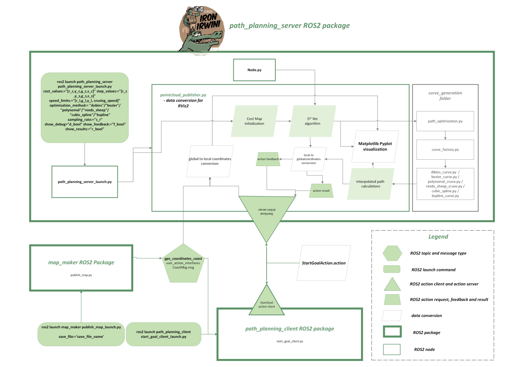
</p>
<p align="center">
<em>
Figure : path_planning_server Package Architecture
</em>
</p>

### Primary Objectives

1. **[Global Path Planning](#global-path-planning)**  
   - The `path_planning_server.py` node uses the D* lite algorithm to compute the optimal path based on start and goal points received from the `start_goal_client.py` node.
   - Parameters such as `coast_values_arg` and `step_sizes_arg` control the cost map resolution and algorithm efficiency.

2. **[Path Interpolation](#path-interpolation)**  
   - Interpolation techniques refine the raw path into a smooth and executable trajectory using programs in the `curve_generation` folder.
   - Parameters like `sampling_rate` and `optimization_method` determine point distribution and curve smoothing.

3. **[Feedback to the path_planning_client](#feedback-to-the-path_planning_client)**  
   - The `path_planning_server.py` node provides feedback to the client with the planned path interpolated and non-interpolated path coordinates, as well as the intermediate results for debugging purposes.

&nbsp;

### **📝  Note:** Compared to all other packages, the **path_planning_client** package achieves all its objectives using a single logical loop and requires only one command to execute its entire workflow, making it highly efficient and streamlined.

&nbsp;

## 🚀 ROS2 Command for Running Path Planning

To execute the launch file, run the following command in your terminal:
```bash
ros2 launch path_planning_server path_planning_server_launch.py
```

If you want to change the default parameters, you can do so by running the following command with the desired parameters, for example:
```bash
ros2 launch path_planning_server path_planning_server_launch.py \
  cost_values:='[10.0, 2.0, 1.5, 1.2]' \
  step_sizes:='[50.0, 50.0, 100.0, 100.0]' \
  speed_limits:='[2.0, 5.0, 8.0, 25.0]' \
  optimization_method:='polynomial' \
  sampling_rate:='5.0' \
  show_feedback:='True' \
  show_results:='True' \
  show_debug:='True' \
  show_downsampling:='False' \
  show_interpolation:='True'
```
### Default Parameters
- `cost_values`
   - Defines the cost values for the cost map of red, green, yellow, and free passage zones, respectively.
- `step_sizes`
   - Determines the step sizes for the D* lite algorithm for red, green, yellow, and free passage zones, respectively.
- `speed_limits`
   - Specifies the speed limits in nautical miles for red, green, yellow, and free passage zones for calculating travel time.
- `optimization_method` 
   - Defines the optimization method for path interpolation, such as polynomial or spline.
- `sampling_rate`
   - Determines the sampling rate for path interpolation.

### Visualization Options
   - `show_feedback` - Displays feedback messages for RViz2 real-time updates
   - `show_debug` - show intermediate results in PyPlot window for debugging
   - `show_results` - show results in PyPlot window
   <p align="center">
   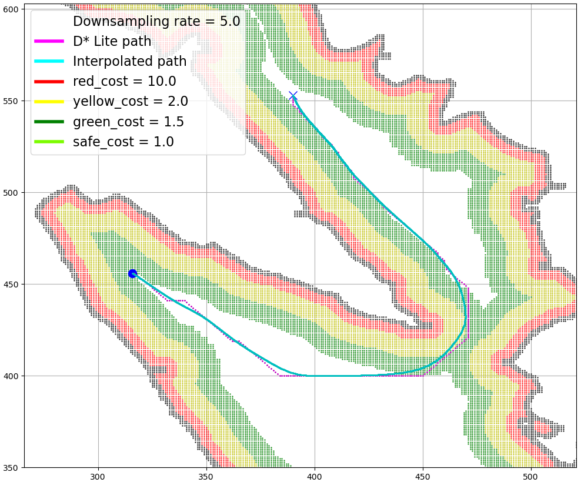
   </p>
   <p align="center">
   <em>
   Figure : Results of the path planning algorithm in PyPlot window
   </em>
   </p>

   - `show_downsampling` - Shows effect of the downsampling parameter `step_sizes` on the path planning algorithm
   <p align="center">
   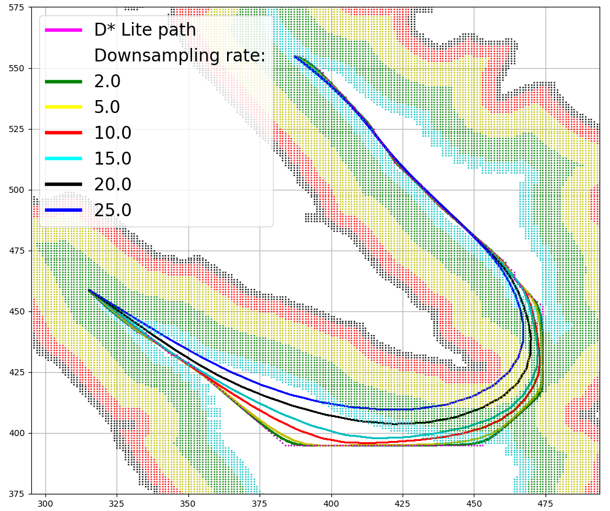
   </p>
   <p align="center">
   <em>
   Figure : Downsampling effect on the path planning algorithm
   </em>
   </p>

   - `show_interpolation` - Shows the effect of the interpolation method on the path planning algorithm
   <p align="center">
   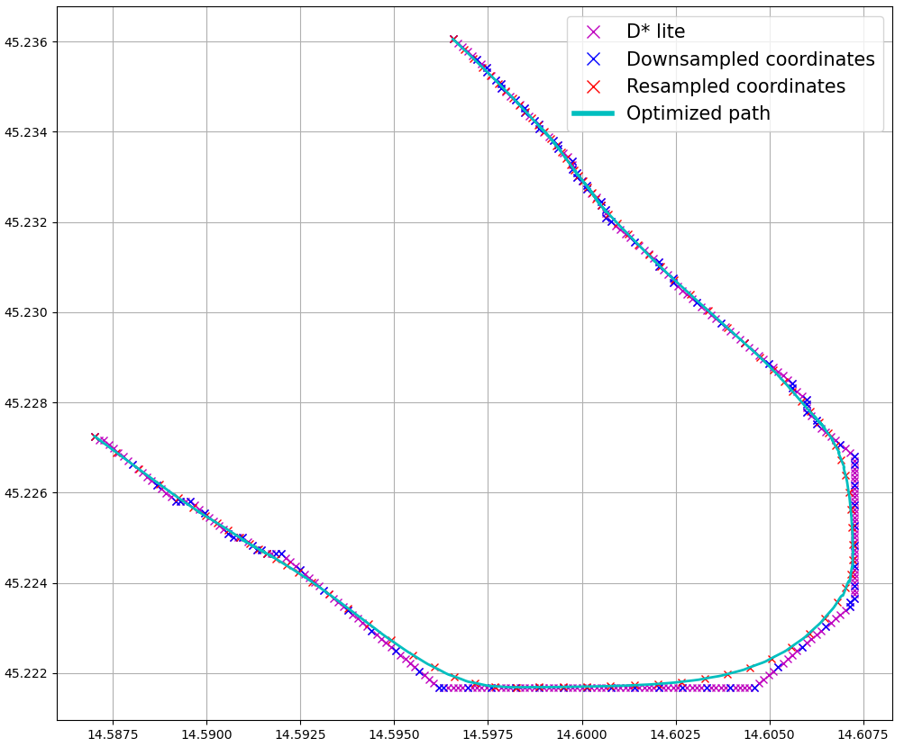
   </p>
   <p align="center">
   <em>
   Figure : Interpolation effect on the path planning algorithm
   </em>
   </p>


### 📋 Notes
- The execution time, path distance and estiamted travel time are displayed in the terminal:
<p align="center">
   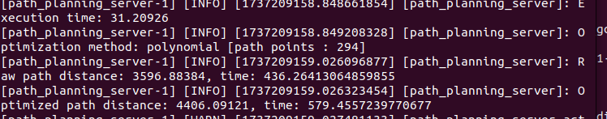
   </p>
   <p align="center">
   <em>
   Figure : Estimated travel time and distance in the terminal
   </em>
</p>

- To visualize the path planning results in RViz2, ensure that **all the visualization windows are closed**, as it stops the RViz2 tool from updating the visualization data.

&nbsp;

## 🏆 Final Path Planning Results in RViz2

If everything is done correctly, the final path planning results should be visible in RViz2 as shown below, with both the D* Lite algorithm and path interpolation results visible:

<p align="center">
   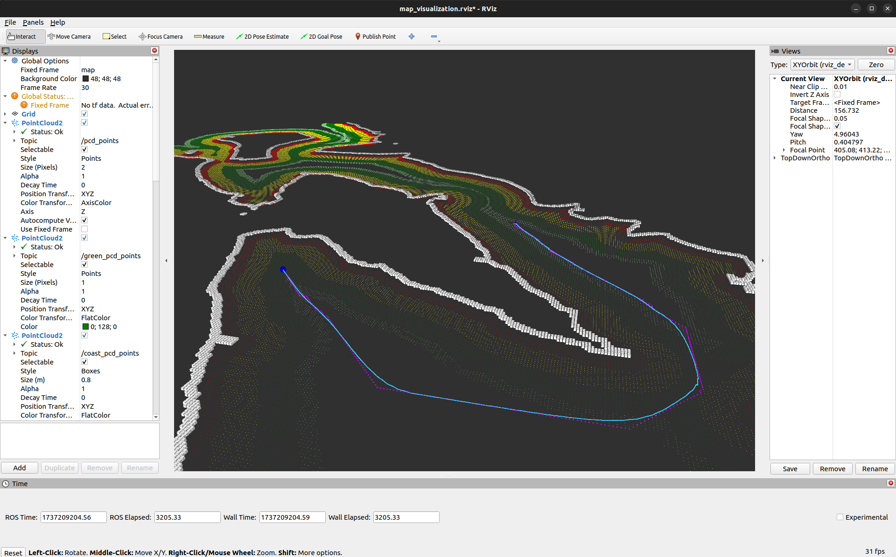
   </p>
   <p align="center">
   <em>
   Figure : RViz2 Visualization of the final path planning results
   </em>
</p>

# 🚢 Example

The following example demonstrates the complete workflow of the ROS2 system architecture for global vessel path planning. The example uses the `map_maker`, `path_planning_client`, and `path_planning_server` packages to generate a feasible path for a vessel navigating from the start to the goal point. in [Soline Bay, Croatia](https://www.openstreetmap.org/#map=13/45.15662/14.64220)

## 1. Map Creation

In the input_data directory there are provided few maps of Soline Bay, Croatia. To create a cost map for path planning, run the following command in the Linux terminal:

```sh
ros2 launch map_maker make_map_launch.py save_file_name:="klimno" locations:='["dramalj", "crikvenica", "selce", "rudine", "klimno", "silo", "petrina", "vodica", "melska"]' grid_size:="10" 
```

Where dramalj, crikvenica, selce, rudine, klimno, silo, petrina, vodica, melska are the names of the folders in the `input_data` directory containing the map data.

If everything is done correctly, the processed map should be visible in the map_data directory as a binary file named `processed_map_klimno`.

You can visualize the map using the following command:

```sh
ros2 launch map_maker visualization_map_launch.py save_file:="klimno"
```
<p align="center">
   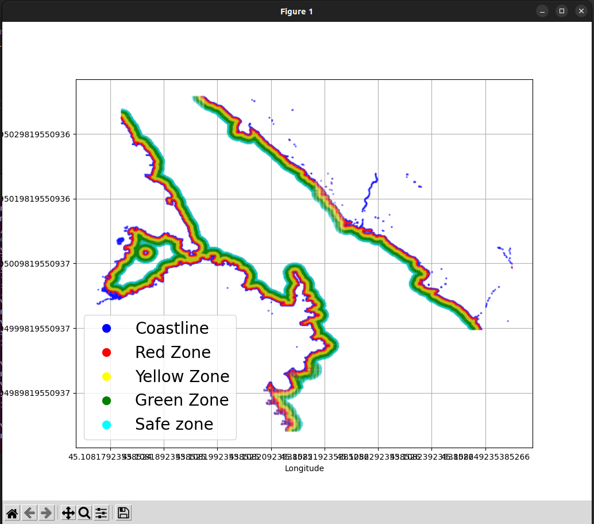
   </p>
   <p align="center">
   <em>
   Figure : Visualized map of Soline Bay, Croatia
   </em>
</p>

## 2. Open RViz2 and Visualize the Cost Map

To publish the generated map using the ROS2 publisher `gps_coordinates_coast`, execute the following command in the Linux terminal:

```sh
ros2 launch map_maker publish_map_launch.py save_file:='klimno'
```

To visualize the cost map and open RViz2, run the following command in the Linux terminal:

```sh
ros2 launch path_planning_client rviz2_pointcloud_launch.py
```

<p align="center">
   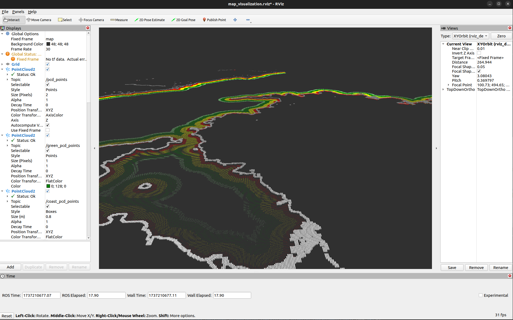
   </p>
   <p align="center">
   <em>
   Figure : RViz2 Visualization of the cost map of Soline Bay, Croatia
   </em>
</p>

## 3. Set Start and Goal Points

Open [Google Maps](https://www.google.com/maps) and find the coordinates of the start and goal points in Soline Bay, Croatia. For example, the start point is at 45.164342, 14.608422 and the goal point is at 45.150569, 14.660261

<p align="center">
   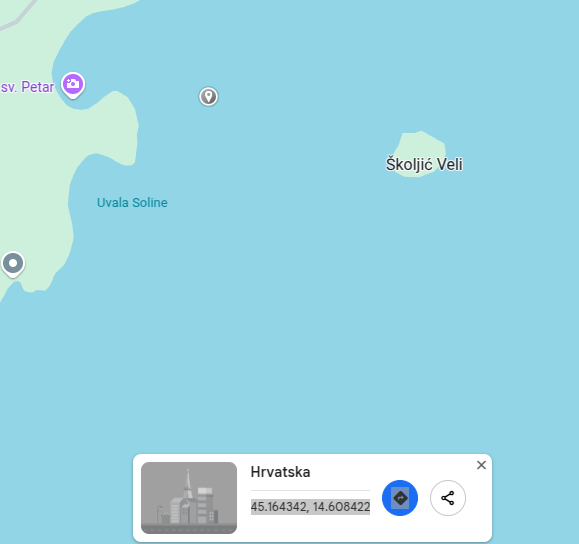
   </p>
   <p align="center">
   <em>
   Figure : Start point coordinates fetched from Google Maps
   </em>
</p>

To set the start and goal points manually via the terminal, execute the following command in the Linux terminal:

```sh
ros2 launch path_planning_client update_start_goal_launch.py start:="[45.164342, 14.608422]" goal:="[45.150569, 14.660261]"
```
The same can be done via RViz2 by using the `2D Pose Estimate` and `2D Nav Goal` tools, but direct terminal input is more precise.

## 4. Path-Planning

Action client-server communication mechanism ensures that the start and goal points are successfully published and available for path planning. To start client mechanism, run the following command in the Linux terminal:

```sh
ros2 launch path_planning_client start_goal_client_launch.py
```

This command will start the client mechanism and wait for the path planning server to generate the path. To execute the path planning server, run the following command in the Linux terminal:

```sh
ros2 launch path_planning_server path_planning_server_launch.py
```

Furthermore, you can visualize path-planninh mechanism steps in pyplot window by setting the `show_results`, `show_interpolation`, `show_downsampling` to True:

```sh
ros2 launch path_planning_server path_planning_server_launch.py show_results:='True' show_interpolation:='True' show_downsampling:='True'
```
Note that the other parameters can be changed as well, as described before, but they were used in development of the system and are not necessary for the final path planning demonstration. Thus, the default parameters are used to alter the path planning algorithm results and user can change them as needed to achieve the desired results.

<p align="center">
   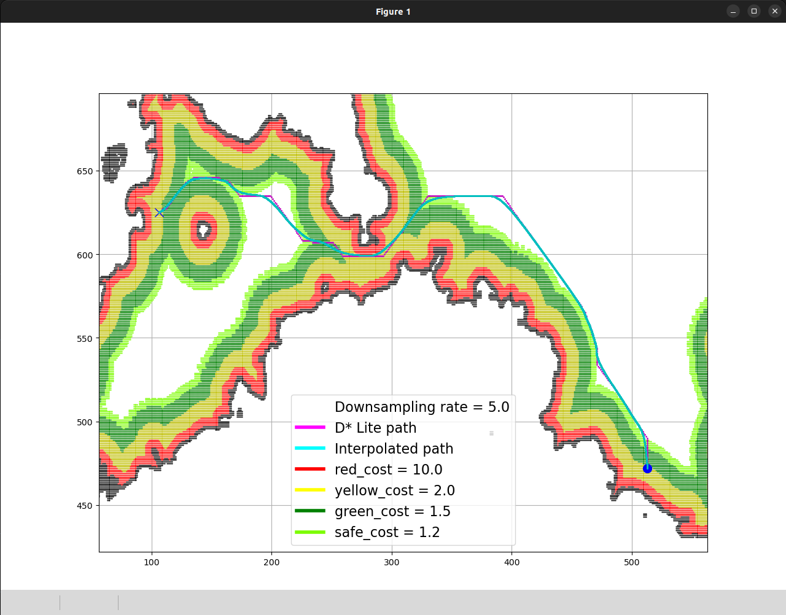
   </p>
   <p align="center">
   <em>
   Figure : Soline bay final path planning results : show_results:='True'
   </em>
</p>

<p align="center">
   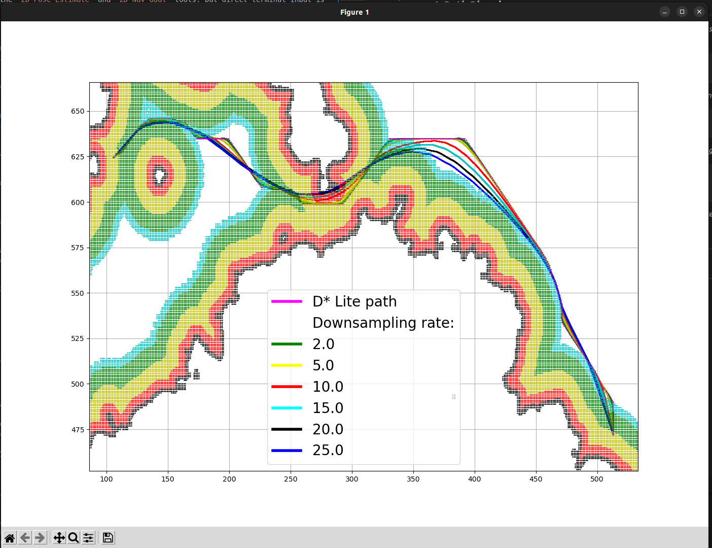
   </p>
   <p align="center">
   <em>
   Figure : Soline bay downsampling effect on the path planning algorithm : show_downsampling:='True'
   </em>
</p>

<p align="center">
   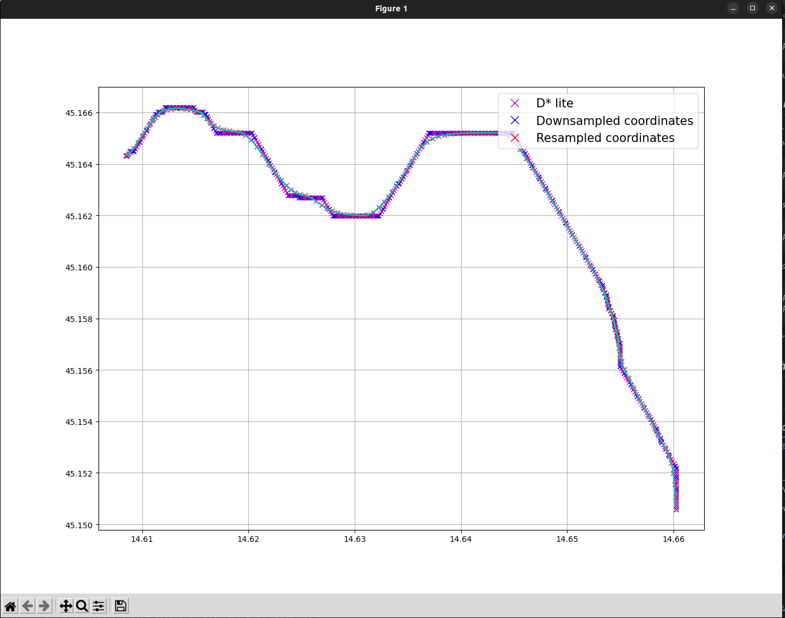
   </p>
   <p align="center">
   <em>
   Figure : Soline bay interpolation effect on the path planning algorithm : show_interpolation:='True'
   </em>
</p>

## 5. Final Path-Planning Results in RViz2

If everything is done correctly, the final path planning results should be visible in RViz2 as shown below where both D* Lite algorithm and path interpolation results are visible:

<p align="center">
   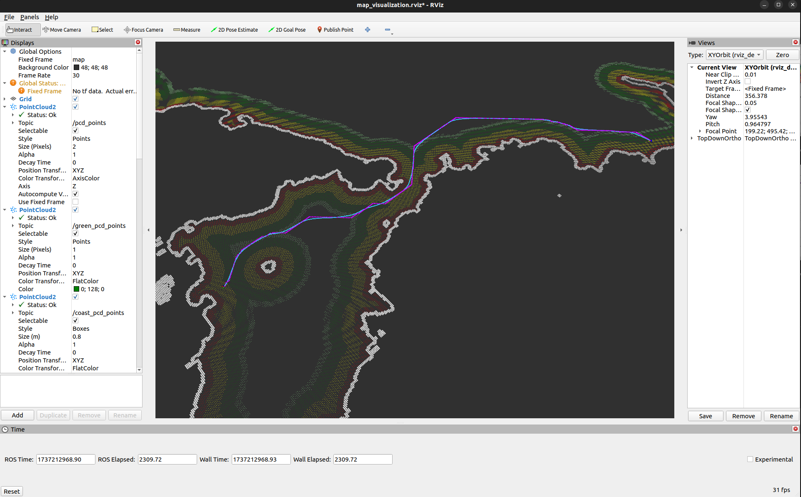
   </p>
   <p align="center">
   <em>
   Figure : Soline bay final path planning results in RViz2
   </em>
</p>

## 📈 Future Work

- Develop a user-friendly GUI for path planning and control
- Implement dynamic vessel model for path planning based on vessel type 
- Implement advanced path planning algorithms to improve path smoothness and efficiency
- Optimize runtime calculations for path planning (C++ implementation) to reduce execution time
- Replace the map_maker package with a more efficient and precise map creation tool
- Implement path planning for multiple vessels
- Implement path planning for multiple goals and start points
- Risk assessment and safety analysis for path planning
- Support for local (dynamic) real-time vessel path planning
   - Dynamic cost map updates based on real-time data
   - Dynamic risk assessment strategies
   - Integration with external systems for navigation and control
   - Environmental data integration 
   - Collision, Grounding and obstacle avoidance algorithms
   - COLREG rules implementation
   - Simulation and real-world testing


## 📧 Credits
&NewLine;

The diploma thesis project was developed by the following authors and mentors:

Academic Title | Author|GitHub | e-mail
| :--- | :---: | :---: | :---:
univ. mag. ing. inf. et comm. techn. | Enio Krizman  | [@kr1zzo](https://github.com/kr1zzo) | enio.krizman@fer.hr / krizman.enio@outlook.com

Academic Title | Mentor Name | e-mail
| :--- | :---: | :---:
Doc. Dr. Sc. | Đula Nađ  | dula.nad@fer.hr
Dr. Sc. | Nadir Kapetanović  | nadir.kapetanovi@fer.hr

The thesis was defended at the Faculty of Electrical Engineering and Computing, University of Zagreb, on the 9th of July 2024
under the supervision of the following committee members:

Academic Title | Commitee Member | e-mail
| :--- | :---: | :---:
Doc. Dr. Sc. | Đula Nađ | dula.nad@fer.hr
Prof. Dr. Sc. | Nikola Mišković | nikola.miskovic@fer.hr
Doc. Dr. Sc. | Fausto Miguel Pascoal Ferreira | fausto.ferreira@fer.unizg.hr

#### [&copy; Faculty of Electrical Engineering and Computing, University of Zagreb, 2024](https://www.fer.unizg.hr/)


#### [&copy; Laboratory for Underwater Systems and Technologies (LABUST)](https://labust.fer.hr/)


## 🖋️ Acknowledgments

Parts of this repository are based on the following resources and they are used for educational purposes:
* [PythonRobotics repository](https://github.com/AtsushiSakai/PythonRobotics)
* [PythonRobotics documentation](https://arxiv.org/abs/1808.10703)
