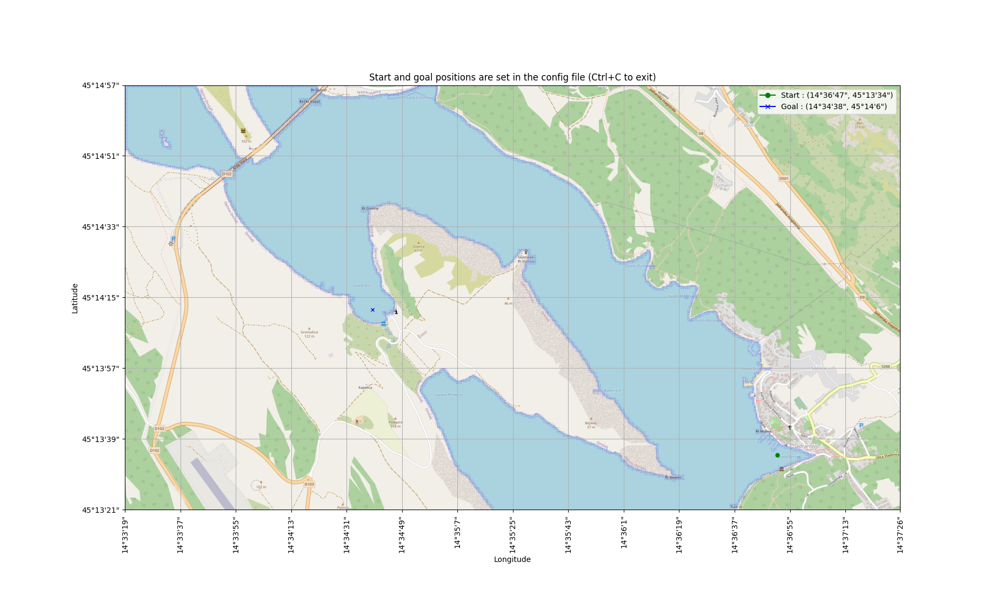
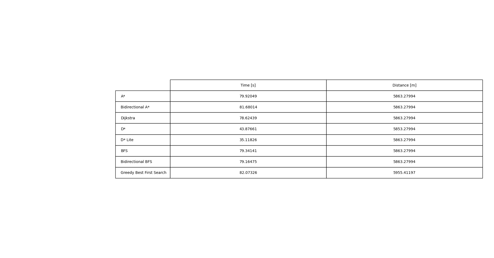
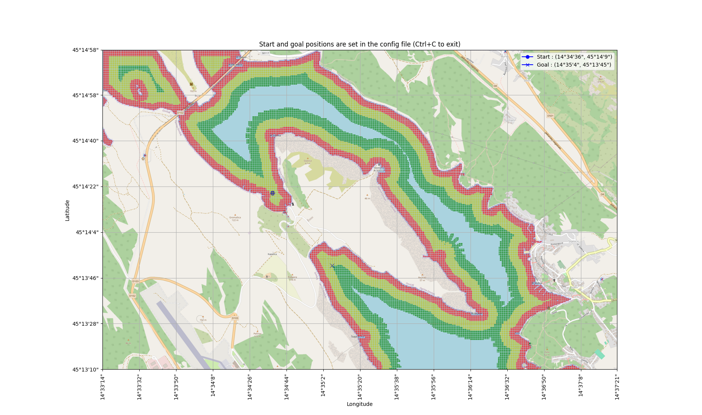

# Model-informed path planning and control for autonomous vessels


## Project description
This repository is a part of the diploma thesis at the Faculty of [Electrical Engineering and Computing, University of Zagreb](https://www.fer.unizg.hr/), [Laboratory for Underwater Systems and Technologies](https://labust.fer.hr/). The main goal of the thesis is to develop a _model-informed path planning and control for autonomous vessels (Croatian: Modelski informirano globalno planiranje putanje i upravljanje autonomnoga plovila)_.  The project is based on the PythonRobotics repository and it is used for educational purposes only.
 Model-informed path planning consists of the following steps:
1. Data extraction and processing from OpenStreetMap
3. Testing of the path planning algorithms from the PythonRobotics repository on the extracted OpenStreetMap data 
4. Cost map generation
5. Path interpolation and optimization
6. Testing of the path planning algorithms on the generated cost map
7. Publishing data to the ROS2 environment and testing the path planning algorithms on the real vessel or in the simulation environment


## Table of Contents

   * [Installing](#installing)
   * [Requirements](#requirements)
   * [Executing program](#executing-program)
        * [Step 1 : Download data from OpenStreetMap](#step-1--download-data-from-openstreetmap)
        * [Step 2 : Data extraction and processing from OpenStreetMap](#step-2--data-extraction-and-processing-from-openstreetmap)
        * [Step 3 : Path planning algorithms testing](#step-3--path-planning-algorithms-testing)
        * [Step 4 : Cost map generation](#step-4--cost-map-generation)
        * [Step 5 : Path interpolation and optimization](#step-5--path-interpolation-and-optimization)
        * [Step 6 : Testing of the path planning algorithms on the generated cost map](#step-6--testing-of-the-path-planning-algorithms-on-the-generated-cost-map)
        * [Step 7 : Publishing data to the ROS2 environment and testing the path planning algorithms on the real vessel or in the simulation environment](#step-7--publishing-data-to-the-ros2-environment-and-testing-the-path-planning-algorithms-on-the-real-vessel-or-in-the-simulation-environment)

  * [Credits](#credits)
  * [Acknowledgments](#acknowledgments)

### Folder structure

```terminal
Model-informed-path-planning
    ├── assets
    │   └── ...
    ├── input_data            # Step 1
    │   └── ...
    ├── osm_data_processing   # Step 2 and Step 4
    │   └── ...
    ├── test_algorithm        # Step 3
    │   └── ...
    ├── results
    │   └── ...
    ├── requirements
    │   └── requirements.txt
    ├── config.yaml
    ├── README.md
    ├── .gitignore
    └── ...
    

## Installing
```terminal
git clone https://github.com/kr1zzo/Model-informed-path-planning.git
```

## Requirements

```terminal
pip install -r requirements/requirements.txt
```

## Executing program

* Steps are marked in `config.yaml` file with `## Step n : ...` and can be changed according to the user's needs.

* After first run, the `results` and `binary_dumps` folders are created


## Step 1 : Download data from OpenStreetMap 

### Folder name : `input_data`

`Steps 1.1. - 1.5. are optional and can be skipped if the default data is used. Feel free to download your data from OpenStreetMap and follow the instructions below!`

In the folder `input_data` are provided default data for the following locations:
- Voz, island of Krk, Croatia
- Jadranovo, Croatia


### 1.1. Go to [OpenStreetMap](https://www.openstreetmap.org/#map=15/45.2359/14.5844) and select the area you want to download

### 1.2. Make new folder `geolocation_name` (for example `Rijeka`) in the `input_data` folder and put `osm_data.txt` file inside

### 1.3. Click on the Download button and download the data in .png format


### 1.4. Copy the downloaded .png file to the `input_data/geolocation_name` folder as `geolocation_name.png`

### 1.5. Copy  HTML string from the OpenStreetMap website and paste it into the `input_data/geolocation_name` folder in the `osm_data.txt` file for extraction of the coordinates


<br />

Folder `input_data` should have the following structure:

```terminal
    input_data
    ├── voz                  
    │   ├── osm_input.txt       # HTML string from the OpenStreetMa
    │   └── voz.png             # .png file from the OpenStreetMap
    ├── jadranovo
    │   ├── osm_input.txt       # HTML string from the OpenStreetMap
    │   └── jadranovo.png       # .png file from the OpenStreetMap
    ├── location_1
    │   ├── osm_input.txt       # HTML string from the OpenStreetMa
    │   └── location_1.png      # .png file from the OpenStreetMap
    ├── location_2
    │   └── ...
    └── ...

```
* location_1, location_2, ..., location_n are the names of the locations added by the user in the previous steps

### 1.6. Update config.yaml file

Example of the config.yaml file for the location `voz`:

- location folder from the `input_data` folder in step 1.2 and location_image is the name of the .png file from step 1.3


 ```yaml
# Process OSM data
location_folder : "voz"
location_image: "voz.png"
```

## Step 2 : Data extraction and processing from OpenStreetMap

### Folder name: `osm_data_processing`

```terminal
  osm_data_processing
    ├── detect_coastline.py
    ├── generate_costmap.py
    ├── process_osm_data.py
    ├── set_start_goal.py
    └── main.py

```

* `main.py` - main file for data extraction and processing and runs the following files:
    * `process_osm_data.py` - file for data extraction and processing from Step 1
    * `detect_coastline.py` - file for detecting coastline and coast points and marking them on the map
    * `set_start_goal.py` - file for setting start and goal points on the map and plotting them on the map
    * `generate_costmap.py` - file for generating cost map from the map and coastline data - needed for later steps


### 2.1. Choose start and goal points on the map

- Set `resized_location_image` name for the resized map from the previous step. It is saved in the `results` folder for further steps
- Set `costume_start_goal` to `True` if you want to choose start and goal points with a mouse click on the map or `False` if you want to add start and goal points manually in the config.yaml file
Disable cost map generation in the `config.yaml` file or start and goal points will be disabled on the map generation

```yaml
...
## Step 4: Cost map generation
generate_costmap : False
```

### 2.2. Run the following command to generate map and detect the coastline

 ```terminal
  python3 main.py
  ```

### 2.2.3. Check the results

* the map is resized to 1 $pixel$ per 1 $meter^2$
* coastline is marked with a light blue color
* the start is marked with a green circle and the goal with a blue X
* axis are displayed in geographical coordinates
* longitude and latitude of the grid the start and goal points are displayed in legend
* geolocation data marked in the map should be the same as geolocation data in the OpenStreetMap, Google Maps, etc.

**Example of the map with start and goal points hardcoded in the config.yaml file:**




## Step 3 : Path planning algorithms testing

Folder name: `test_algorithm`

```terminal
  test_algorithm
    ├── algorithms
    │   ├── a_star.py
    │   ├── bidirectional_a_star.py
    │   ├── dijkstra.py
    │   ├── dstar.py
    │   ├── d_star_lite.py
    │   ├── breadth_first_search.py
    │   ├── bidirectional_breadth_first_search.py
    │   ├── depth_first_search.py
    │   └── greedy_best_first_search.py
    ├── algorithms_class.py
    ├── plot.py
    ├── test.py
    └── main.py

```

* `main.py` - main file for testing path planning algorithms and runs following files:
    * `test.py` - file for testing path planning algorithms and runs the algorithms from the `algorithms` folder
    * `algorithms_class.py` - class for path planning algorithms
    * `plot.py` - file for plotting the results of the path planning algorithms on the map and table with the result runtime and path length in meters

### 3.1. Update config.yaml file

- Set `result_image` name for the map with the path planning algorithm results and table_name for the table with the runtime results and path length
- Set `grid_size` and `robot_radius` for the path planning algorithms, recommended values are boat length and width as grid size and robot radius as 1/2 of the boat length
- Set `thread_enable` if runtime results are not needed and thread_enable map if runtime results are needed for algorithm runtime comparison
  - `thread_enable : True` - overall runtime is lower, but runtime of each algorithm is higher
- Set the path planning algorithm you want to test in the `test_algorithm` variable
- Set the path planning algorithm you want to plot in the `plot_algorithm` variable


```yaml
## Step 3: Path planning algorithms testing

result_image : "voz_result.png"
table_name : "runtime_results.png"
result_image_name : "result_image.png"

grid_size : 10.0  # [m]
robot_radius : 5.0  # [m]

# thread_enable : True - thread for plotting map
# thread_enable map : False - for algorithm runtime calculation
thread_enable : False

test_algorithm :  #plot_algorithm
- "a_star"
- "bidirectional_a_star"
- "dijkstra"
- "d_star"
- "d_star_lite"
- "breadth_first_search"
- "bidirectional_breadth_first_search"
- "greedy_best_first_search"
```

### 3.2. Run the following command to test path-planning algorithms

Run for testing and plotting algorithms:
 ```terminal
  python3 main.py
```
Run for testing algorithms runtime:
 ```terminal
  python3 test.py
```
Run for plotting the results:
 ```terminal
  python3 plot.py
```


### 3.3. Check the results

* Results are saved in the `results` folder with the name `result_image` and `table_name`

**Example of the map with the path planning algorithm results:**


**Example of the table with the runtime results and path length:**



//TODO : fix D* Lite algorithm

## Step 4 : Cost map generation

### Folder name: `osm_data_processing`

* cost map generation is needed for the path interpolation and optimization in Step 5
* the current cost map is based on the distance from the coast
* TODO: Implement costmap based on the depth, obstacles, etc.

### 4.1. Update config.yaml file

- Set `cost_map` to `True` in the `config.yaml` file and set the `result_costmap_name` for the cost map figure name

```yaml
## Step 4: Cost map generation
result_costmap_name : "voz_costmap.png"
cost_map : True
```

### 4.2. Run the following command to generate cost map

* Same as in the Step 2.2. Run the following command in the folder `osm_data_processing` to generate a cost map, but set `generate_costmap` to `True` in the `config.yaml` file
disables the start and goal points on the map generation
 ```terminal
  python3 main.py
```

Example of the prototype cost map:



//TODO : add more directions and fix empty spaces, connect meters with geolocations

## Step 5 : Path interpolation and optimization

//TODO

## Step 6 : Testing of the path planning algorithms on the generated cost map

//TODO

## Step 7 : Publishing data to the ROS2 environment and testing the path planning algorithms on the real vessel or in the simulation environment

//TODO

## Credits

#### [&copy; Faculty of Electrical Engineering and Computing, University of Zagreb, 2024](https://www.fer.unizg.hr/)

#### [&copy; Laboratory for Underwater Systems and Technologies (LABUST)](https://labust.fer.hr/)


&NewLine;

Contributors names and contact info

Author|GitHub | e-mail
| :--- | :---: | :---:
Enio Krizman  | [@kr1zzo](https://github.com/kr1zzo) | enio.krizman@fer.hr

Mentors | e-mail
| :--- | :---: 
Doc. Dr. Sc. Đula Nađ  | dula.nad@fer.hr
Dr. Sc. Nadir Kapetanović  | nadir.kapetanovi@fer.hr

## Acknowledgments

This repository is built using the following resources and it is used only for educational purposes:
* [PythonRobotics](https://github.com/AtsushiSakai/PythonRobotics)
