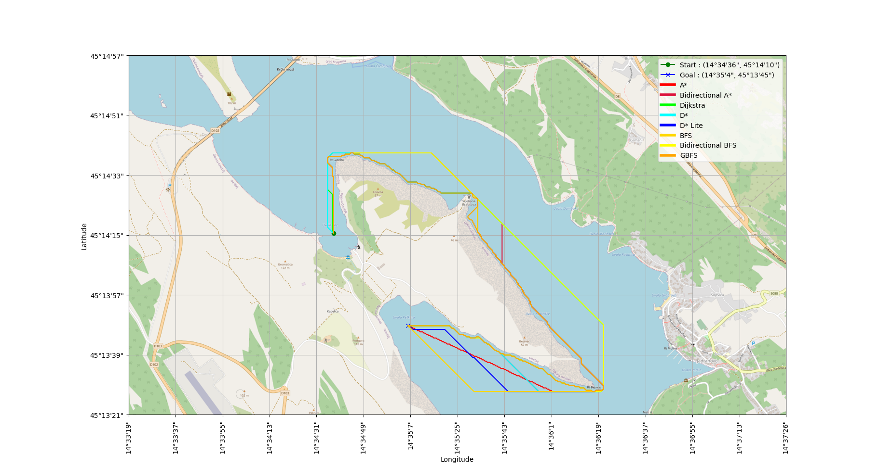

# Model-informed path planning and control for autonomous vessels


## Project description
This repository is a part of the diploma thesis at the Faculty of [Electrical Engineering and Computing, University of Zagreb](https://www.fer.unizg.hr/), [Laboratory for Underwater Systems and Technologies](https://labust.fer.hr/). The main goal of the thesis is to develop a _model-informed path planning and control for autonomous vessels (Croatian: Modelski informirano globalno planiranje putanje i upravljanje autonomnoga plovila)_.  The project is based on the PythonRobotics repository and it is used for educational purposes only.
 Model-informed path planning consists of the following steps:
1. Data extraction and processing from OpenStreetMap
3. Testing of the path planning algorithms from the PythonRobotics repository on the extracted OpenStreetMap data 
4. Cost map generation
5. Testing of the path planning algorithms on the generated cost map
6. Path interpolation and optimization
7. Publishing data to the ROS2 environment and testing the path planning algorithms on the real vessel or in the simulation environment


## Table of Contents

   * [Installing](#installing)
   * [Requirements](#requirements)
   * [Executing program](#executing-program)
        * [Folder structure](#folder-structure)
        * [Step 1 : Download data from OpenStreetMap](#step-1--download-data-from-openstreetmap)
        * [Step 2 : Data extraction and processing from OpenStreetMap](#step-2--data-extraction-and-processing-from-openstreetmap)
        * [Step 3 : Path planning algorithms testing](#step-3--path-planning-algorithms-testing)
        * [Step 4 : Cost map generation](#step-4--cost-map-generation)
        * [Step 5 : Testing of the path planning algorithms on the generated cost map](#step-5--testing-of-the-path-planning-algorithms-on-the-generated-cost-map)
        * [Step 6 : Path interpolation and optimization](#step-6--path-interpolation-and-optimization)
        * [Step 7 : Publishing data to the ROS2 environment and testing the path planning algorithms on the real vessel or in the simulation environment](#step-7--publishing-data-to-the-ros2-environment-and-testing-the-path-planning-algorithms-on-the-real-vessel-or-in-the-simulation-environment)

  * [Credits](#credits)
  * [Acknowledgments](#acknowledgments)


## Installing
```terminal
git clone https://github.com/kr1zzo/Model-informed-path-planning.git
```

## Requirements

```terminal
pip install -r requirements/requirements.txt
```

## Executing program


### Folder structure

```terminal
Model-informed-path-planning
    ├── assets
    │   └── ...
    ├── input_data            # Step 1
    │   └── ...
    ├── osm_data_processing   # Step 2 and Step 4
    │   └── ...
    ├── test_algorithm        # Step 3
    │   └── ...
    ├── results
    │   └── ...
    ├── requirements
    │   └── requirements.txt
    ├── config.yaml
    ├── README.md
    ├── .gitignore
    └── ...
```

* Steps are marked in `config.yaml` file with `## Step n : ...` and can be changed according to the user's needs.

* After [first run](#2.2.-Run-the-following-command-to-generate-map-and-detect-the-coastline), the `results` and `binary_dump` folders are created for saving the results and binary files for the path planning algorithms

## Step 1 : Download data from OpenStreetMap (optional)

### Folder name : `input_data`

`Step 1. is optional and can be skipped if the default data is used. Feel free to download your data from OpenStreetMap and follow the instructions below!`

In the folder `input_data` are provided default data for the following locations:
- Voz, island of Krk, Croatia
- Jadranovo, Croatia


### 1.1. Go to [OpenStreetMap](https://www.openstreetmap.org/#map=15/45.2359/14.5844) and select the area you want to download

### 1.2. Make new folder `geolocation_name` (for example `Rijeka`) in the `input_data` folder and put `osm_data.txt` file inside

### 1.3. Click on the Download button and download the data in .png format

<p align="center">

</p>
<p align="center">
<em>
Figure 1: Download data from OpenStreetMap
</em>
</p>


### 1.4. Copy the downloaded .png file to the `input_data/geolocation_name` folder as `geolocation_name.png`

### 1.5. Copy  HTML string from the OpenStreetMap website and paste it into the `input_data/geolocation_name` folder in the `osm_data.txt` file for extraction of the coordinates

<p align="center">

</p>
<p align="center">
<em>
Figure 2: Copy HTML string from OpenStreetMap
</em>
</p>

<br/>


### 1.6. Update config.yaml file

Example of the config.yaml file for the location `voz`:

- location folder from the `input_data` folder in step 1.2 and location_image is the name of the .png file from step 1.3


 ```yaml
## Step 1: Download data from OpenStreetMap (optional)
# Process OSM data
location_folder : "voz"
location_image: "voz.png"
```
### 1.7. Check the results

Folder `input_data` should have the following structure:

```terminal
    input_data
    ├── voz                  
    │   ├── osm_input.txt       # HTML string from the OpenStreetMa
    │   └── voz.png             # .png file from the OpenStreetMap
    ├── voz2                  
    │   ├── osm_input.txt       # HTML string from the OpenStreetMa
    │   └── voz2.png             # .png file from the OpenStreetMap
    ├── jadranovo
    │   ├── osm_input.txt       # HTML string from the OpenStreetMap
    │   └── jadranovo.png       # .png file from the OpenStreetMap
    ├── location_1
    │   ├── osm_input.txt       # HTML string from the OpenStreetMa
    │   └── location_1.png      # .png file from the OpenStreetMap
    ├── location_2
    │   └── ...
    └── ...

```
* location_1, location_2, ..., location_n are the names of the locations added by the user in the previous steps
## Step 2 : Data extraction and processing from OpenStreetMap

### Folder name: `osm_data_processing`

`In this step, the OpenStreetMap data is processed and the map is resized to 1 pixel per 1 meter. Coastline is detected and start and goal points are set on the map.`

```terminal
  osm_data_processing
    ├── detect_coast.py
    ├── process_osm_data.py
    ├── set_start_goal.py
    └── main.py
```

* `main.py` - main file for detecting coastline, setting start and goal points on the map and generating the cost map. Results are saved in the `binary_dump` folder for further steps and in the `results` folder for visualization
  
* `process_osm_data.py`:
    * Processing the OpenStreetMap data from osm_data.txt file
    * Converting GPS coordinates to the meters
    * Converting GPS coordinates to the pixels
    * Converting GPS coordinates to the DMS format
    * Resize the map to 1 pixel per 1 meter
    * Prepare image with geolocation data for plotting
* `detect_coast.py` - file for detecting coastline and coast points and marking them on the map
    * Detecting the coastline from the image
    * Detecting if (x, y) point is on the coast or at the sea
    * Detecting zones based on the distance from the coast (red, yellow, green) - cost map generation
* `set_start_goal.py` - file for setting start and goal points on the map and plotting them on the map
    * Setting start and goal points on the map
      * Option 1: Set start and goal points with a mouse click on the map
      * Option 2: Set start and goal points manually in the config.yaml file
    * Plotting start and goal points on the map


### 2.1. Update config.yaml file

* Set `resized_location_image` name for the resized map from the previous step. It is saved in the `results` folder for further steps
* Disable the cost map generation by setting `cost_map` to `False`
* Set `custom_start_goal` to `True` if you want to choose the start and goal points with a mouse click on the map or `False` if you want to add start and goal points manually in the config.yaml file
    * If `custom_start_goal` is set to `False`, set the `start_latitude`, `start_longitude`, `goal_latitude`, and `goal_longitude` in the config.yaml file. You can get the coordinates from the [OpenStreetMap](https://www.openstreetmap.org/#map=15/45.2300/14.5868), [Google Maps](https://www.google.com/maps/@45.2353117,14.5923406,14.61z?entry=ttu), etc.

The example of the config.yaml file for the location `voz`:
```yaml
## Step 2 : Data extraction and processing from OpenStreetMap 
## Step 4: Cost map generation

resized_location_image : "voz_resized2.png"
result_costmap_name : "voz_costmap.png"

# Step 2 : False, Step 4 : True
cost_map : False

custom_start_goal : False
# This is hardcoded start and goal position and applied only if custom_start_goal is False
start_latitude : 45.234781
start_longitude: 14.577538

goal_latitude : 45.230241
goal_longitude: 14.583173
```

### 2.2. Run the following command 

Run the following command in the folder `osm_data_processing` to generate a map, detect the coastline and set the start and goal points on the map

 ```terminal
  python3 main.py
  ```

### 2.2.1. Check the results

* the map is resized to 1 $pixel$ per 1 $meter^2$
* coastline is marked with a light blue color
* the start is marked with a green circle and the goal with a blue X
* axis are displayed in geographical coordinates
* longitude and latitude of the grid the start and goal points are displayed in legend
* geolocation data marked in the map should be the same as geolocation data in the OpenStreetMap, Google Maps, etc.

**Example of the map with start and goal points hardcoded in the config.yaml file:**

<p align="center">

</p>
<p align="center">
<em>
Figure 3: Example of the map with start and goal points
</em>
</p>

## Step 3 : Path planning algorithms testing

Folder name: `test_algorithm`

```terminal
  test_algorithm
    ├── algorithms
    │   ├── a_star.py
    │   ├── bidirectional_a_star.py
    │   ├── dijkstra.py
    │   ├── dstar.py
    │   ├── d_star_lite.py
    │   ├── breadth_first_search.py
    │   ├── bidirectional_breadth_first_search.py
    │   ├── depth_first_search.py
    │   └── greedy_best_first_search.py
    ├── algorithms_class.py
    ├── plot.py
    ├── test.py
    └── main.py

```

* `main.py` - main file for testing path planning algorithms and runs following files:
    * `test.py` - file for testing path planning algorithms and runs the algorithms from the `algorithms` folder
    * `algorithms_class.py` - class for path planning algorithms
    * `plot.py` - file for plotting the results of the path planning algorithms on the map and table with the result runtime and path length in meters

### 3.1. Update config.yaml file

- Set `result_image` name for the map with the path planning algorithm results and table_name for the table with the runtime results and path length
- Set `grid_size` and `robot_radius` for the path planning algorithms, recommended values are boat length and width as grid size and robot radius as 1/2 of the boat length
- Set `thread_enable` if runtime results are not needed and thread_enable map if runtime results are needed for algorithm runtime comparison
  - `thread_enable : True` - overall runtime is lower, but runtime of each algorithm is higher
- Set the path planning algorithm you want to test in the `test_algorithm` variable
- Set the path planning algorithm you want to plot in the `plot_algorithm` variable


```yaml
## Step 3: Path planning algorithms testing

result_image : "voz_result.png"
table_name : "runtime_results.png"
result_image_name : "result_image.png"

grid_size : 10.0  # [m]
robot_radius : 5.0  # [m]

# thread_enable : True - thread for plotting map
# thread_enable map : False - for algorithm runtime calculation
thread_enable : False

test_algorithm :  #plot_algorithm
- "a_star"
- "bidirectional_a_star"
- "dijkstra"
- "d_star"
- "d_star_lite"
- "breadth_first_search"
- "bidirectional_breadth_first_search"
- "greedy_best_first_search"
```

### 3.2. Run the following command to test path-planning algorithms

Run for testing and plotting algorithms:
 ```terminal
  python3 main.py
```
Run for testing algorithms runtime:
 ```terminal
  python3 test.py
```
Run for plotting the results:
 ```terminal
  python3 plot.py
```


### 3.2.3. Check the results

* Results are saved in the `results` folder with the name `result_image` and `table_name`


<p align="center">



<p align="center">
<em>
Figure 4: Example of the map with the path planning algorithm results
</em>
</p>

<p align="center">


<p align="center">
<em>
Figure 5: Example of the table with the runtime results and path length
<em>
</p>

## Step 4 : Cost map generation

### Folder name: `osm_data_processing`

* cost map generation is needed for the path interpolation and optimization in Step 5
* the current cost map is based on the distance from the coast
* TODO: Implement costmap based on the depth, obstacles, etc.
* TODO: develop the solution for the bridge detections and elimination from the provided data

### 4.1. Update config.yaml file

- Set `cost_map` to `True` in the `config.yaml` file and set the `result_costmap_name` for the cost map figure name
- Set `cost_map_show` to `True` if you want to show the cost map on the plots or `False` if you want to skip the cost map visualization

```yaml
## Step 4: Cost map generation
result_costmap_name : "voz_costmap.png"
cost_map : True
cost_map_show : True
```

### 4.2. Run the following command to generate cost map

* Same as in the Step 2.2. Run the following command in the folder `osm_data_processing` to generate a cost map, but set `generate_costmap` to `True` in the `config.yaml` file

 ```terminal
  python3 main.py
```

### 4.3. Select start and goal points on the cost map

* [Step 2.1. Choose start and goal points on the map](#2.1.-Choose-start-and-goal-points-on-the-map)

### 4.4. Check the results

* Zones are marked with different colors based on the distance from the coast
and determined according to the prescribed [safety regulations in Croatia](https://www.angelina.hr/en/blog/minimum-distance-between-yachts-and-the-coast-in-croatia)
* Zone under 50 meters is marked with red color, zone from 50 to 150 meters is marked with yellow color, and zone from 150 to 300 meters is marked with green color

<p align="center">

</p>

<p align="center">
<em>
Figure 6: Example of the cost map
</em>


## Step 5 : Testing of the path planning algorithms on the generated cost map

### Folder name: `test_algorithm`

* From step 3, the path planning algorithm with the best results is chosen for the path interpolation and optimization (D* lite),and code is modified to fit the cost map generated in the previous step

### 5.1. Update config.yaml file

* Path optimization is based on the cost map generated in the previous step and zone cost values are set in the `config.yaml` file

```yaml
red_cost : 10
yellow_cost : 5
green_cost : 2
```


## Step 6 : Path interpolation and optimization

* From the results of the path planning algorithms, path interpolation and optimization are needed for the path planning algorithms to be used in the real environment

//TODO

## Step 7 : Publishing data to the ROS2 environment and testing the path planning algorithms on the real vessel or in the simulation environment

//TODO

## Credits

#### [&copy; Faculty of Electrical Engineering and Computing, University of Zagreb, 2024](https://www.fer.unizg.hr/)

#### [&copy; Laboratory for Underwater Systems and Technologies (LABUST)](https://labust.fer.hr/)


&NewLine;

Contributors names and contact info

Author|GitHub | e-mail
| :--- | :---: | :---:
Enio Krizman  | [@kr1zzo](https://github.com/kr1zzo) | enio.krizman@fer.hr

Mentors | e-mail
| :--- | :---: 
Doc. Dr. Sc. Đula Nađ  | dula.nad@fer.hr
Dr. Sc. Nadir Kapetanović  | nadir.kapetanovi@fer.hr

## Acknowledgments

This repository is built using the following resources and it is used only for educational purposes:
* [PythonRobotics repository](https://github.com/AtsushiSakai/PythonRobotics)
* [PythonRobotics documentation](https://arxiv.org/abs/1808.10703)
