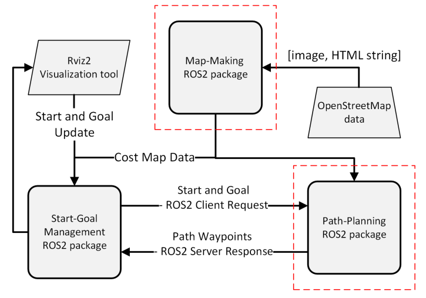

# [Model-informed Path-Planning and Control for Autonomous Vessels](https://repozitorij.fer.unizg.hr/islandora/object/fer:12451)

*System Architecture and Implementation of Global Vessel Path Planning Based on ROS2 Framework*


<div style="text-align: center;">
    
</div>

## 📚 Table of Contents

   * [Project Information](#-project-information)
   * [Installing](#installing)
   * [Requirements](#requirements)
   * [ROS2 Software Architecture for Vessel Path Planning](#-ros2-software-architecture-for-vessel-path-planning)
   * [`map_maker` Package](#️-map_maker-package)
      * [Step 1 : Download data from OpenStreetMap](#step-1--download-data-from-openstreetmap)
      * [Step 2 : ]
  * [`path_planning_client` Package](#path_planning_client-package)
  * [`path_planning_server` Package](#path_planning_server-package)
  * [Credits](#credits)
  * [Acknowledgments](#acknowledgments)

### 🔗 Direct Link to the ROS2 Commands

- [Running the map_maker Package](#running-the-map_maker-package)
- [Running the path_planning_client Package](#running-the-path_planning_client-package)
- [Running the path_planning_server Package](#running-the-path_planning_server-package)

## 💡 Project Information

**This repository is a part of the diploma thesis at the Faculty of [Electrical Engineering and Computing, University of Zagreb](https://www.fer.unizg.hr/), [Laboratory for Underwater Systems and Technologies](https://labust.fer.hr/) in the academic year 2023./2024. The main goal of the thesis is to develop a _model-informed path planning and control for autonomous vessels (Croatian: Modelski informirano globalno planiranje putanje i upravljanje autonomnoga plovila)_.**

**The `documentation` directory contains the final thesis and IEEE conference paper submissions, offering an in-depth description of the project.**

&NewLine;

## ⚙️ Installing
```terminal
git clone https://github.com/kr1zzo-FER/Model-Informed-Path-Planning.git
```

## 📋 Requirements

```terminal
pip install -r requirements/requirements.txt
```

## 🤖 ROS2 Software Architecture for Vessel Path Planning

Project involves the development of a modular software system architecture for global vessel path planning using **[Robot Operating System 2 (ROS2), version : Iron](https://docs.ros.org/en/iron/index.html)**. The system is designed to be flexible and scalable, integrating OpenStreetMap data, RViz2 visualization tools, and advanced path planning algorithms. The architecture consists of three main stages, as outlined below.

The system architecture is divided into three logical stages, with each stage implemented as a ROS2 package:
1. **[Map-Making Package `map_maker`](#️-map_maker-package)**: Extracts geographic data from OpenStreetMap and publishes a cost map.
2. **[Start-Goal Management Package `path_planning_client`](#path_planning_client-package)**: Sets up start and goal coordinates, managing visualization and action communication.
3. **[Path-Planning Package `path_planning_server`](#path_planning_server-package)**: Implements the D* Lite algorithm with interpolation to generate a smooth path.


<p align="center">

</p>
<p align="center">
<em>
Figure 1: Block diagram of the ROS2 system architecture.
</em>
</p>

### Key Components

1. **Workspace: `path_planning_ws`**
   - Organized into standard ROS2 directories:
     - `src`: Contains core packages (`map_maker`, `path_planning_client`, `path_planning_server`, `user_action_interfaces`).
     - `build`, `install`, and `log`: Support package compilation, installation, and logging.

2. **Packages**

 - 1️⃣ [Map-Making Package map_maker](#️-map_maker-package)
   - **Purpose**: Extract geographic features from OpenStreetMap and create a cost map and publish data in ROS2 framework
   - **Implementation**: 
      - Makes map from OpenStreetMap data
      - Utilizes the Pseudo-Mercator projection (EPSG:3857).
      - Publishes cost maps via a ROS2 publisher.
   - **Output**: Cost maps for path planning.

 - 2️⃣ [Start-Goal Management Package `path_planning_client`](#path_planning_client-package)
   - **Purpose**: Define start and goal coordinates using RViz2 or geographic data.
   - **Implementation**:
      - Employs the ROS2 action client-server mechanism for communication.
      - Converts and visualizes data for coordinate setup.
   - **Output**: Start and goal coordinates published within the ROS2 framework.

 - 3️⃣ [Path-Planning Package `path_planning_server`](#path_planning_server-package)
   - **Purpose**: Generate a feasible and smooth path using the D* Lite algorithm.
   - **Implementation**:
      - Interpolates waypoints for enhanced path smoothness.
      - Exchanging data via the action client-server communication pattern.
   - **Output**: Interpolated paths for vessel navigation.

 - 4️⃣ [Custom Interfaces Package `user_action_interfaces`](#user_action_interfaces-package)

   - **Purpose**: Define custom messages and actions for efficient communication between ROS2 packages.
   - **Implementation**:
      - Provides standardized message types for inter-package data exchange.
      - Includes action definitions for start-goal updates, path planning requests, and feedback.
      - Ensures compatibility across all system components through well-defined interfaces.
   - **Output**: Custom message and action types for seamless communication within the ROS2 framework.


3. **Communication Mechanisms**
   -  📤 [Publisher-Subscriber](https://docs.ros.org/en/iron/Tutorials/Beginner-Client-Libraries/Writing-A-Simple-Py-Publisher-And-Subscriber.html)
      - Shares data such as Cost maps, Visualization data and Coordinate updates.

   - 📨 [Server-Client (Actions)](https://docs.ros.org/en/iron/Tutorials/Beginner-Client-Libraries/Writing-A-Simple-Py-Service-And-Client.html)
      - Manages path planning by:
         - Submitting start/goal coordinates via requests.
         - Providing raw and interpolated path information via feedback.


4. **Black-Box Concept**
   - Geographic data is converted between global and local systems during processing.
   - Ensures compatibility and modularity by exchanging data in global geographic coordinates, allowing seamless integration and upgrades.
   - This modular design supports real-world applications, enabling interoperability with external systems for visualization, navigation, and control.


## 🗺️ map_maker Package

### 🌍 Step 1 : map_maker Package - Download data from OpenStreetMap (optional) 

### Folder name : `map_maker\input_data`

This guide outlines the steps for working with OpenStreetMap (OSM) data, focusing on using the Pseudo-Mercator projection and scaling maps for ROS2 applications.


### 1️⃣ Create Geographic Area Folders
- Navigate to the `input_data` folder in the ROS2 package `map_maker`.
- Create subfolders named after the geographic areas of interest (e.g., `jadranovo`).

### 2️⃣ Download Map Data
- Visit the [OpenStreetMap](https://www.openstreetmap.org/#map=15/45.2359/14.5844) website.
- Select the desired region and set the zoom level to **300 meters**.
- Download:
  - A `.png` image of the map (e.g., `jadranovo.png`) and save it in the respective folder.
  - The HTML share information:
  - Copy the "Share" HTML code.
  - Create a file named `osm_info.txt` in the same folder and paste the HTML code inside.

<p align="center">

</p>
<p align="center">
<em>
Figure 1: Download data from OpenStreetMap
</em>
</p>

<p align="center">

</p>
<p align="center">
<em>
Figure 2: Copy HTML string from OpenStreetMap
</em>
</p>


### 3️⃣ Repeat the Process
   - Repeat the process until you are satisified with selected region consisting of few **300 meters** zoom level images

### 📋 Notes
- For best results, use a zoom level of **300 meters**, as it preserves topographic details while maintaining manageable file sizes.
- Ensure all folders in `input_data` contain both the `.png` image and the `osm_info.txt` file.
- Coordinate transformations are essential for linking image pixels to geographic locations.


📍 `path_planning_ws/src/map_maker`

## map_maker ROS2 Package Overview

The **map_maker** ROS2 package is designed for creating and integrating geographical maps into the ROS2 framework. It shares the typical structure of ROS2 packages and is part of the `path_planning_ws` ROS2 workspace. This package processes data to generate maps and publishes them using a ROS2 publisher. The workflow and associated directories, such as `map_maker` and `launch`, are illustrated in Figures 2.2, 2.3, and 2.4.

## Primary Objectives

1. **Map Creation**: 
   - The package generates geographical maps by processing images and HTML data from OpenStreetMap stored in the `input_data` directory. 
   - The main script, `map_process.py`, coordinates this process by:
     - Initializing parameters from the `make_map_launch.py` file.
     - Iterating over `locations` directories in `input_data` to process map data.

2. **Map Publishing**:
   - The processed maps are saved in the `map_data` directory and published as ROS2 messages.
   - The `map_publisher.py` node converts processed map data into `CoastMsg.msg` format and broadcasts it via the `gps_coordinates_coast` topic.

## Workflow Details

- The **map creation process** begins with `process_osm_data.py`, which:
  - Processes OpenStreetMap data.
  - Creates a local coordinate system.
  - Scales the input image to one pixel per square meter of geographical space.
- Next, `detect_coast.py` detects coastal coordinates and zones based on the processed map, converting them from local to global coordinates.
- After processing, `post_processing.py` aligns and refines the data, preparing the final map saved as a binary file named according to the `save_file_name` parameter.

- The **map publishing process** uses the `map_publisher.py` node to:
  - Load binary map data.
  - Publish the data in ROS2-compatible message formats for use in ROS2 applications.

For a detailed process flow, including visualization, refer to the respective sections in the documentation and the logical diagram in Figure 2.5.


## 🚀 Running the map_maker Package

### **1. Map Creation**

```sh
ros2 launch map_maker make_map_launch.py
```

Default parameters:
```sh
save_file_name:="jadranovo"

locations:='["sv_marko","voz","jadranovo", "kacjak", "rudine"]'

grid_size:="10"

show_plot:="False"
```

To run the command with changed parameters, you can define parameters like this:

```sh
ros2 launch map_maker make_map_launch.py parameter1_name:="parameter1_value" parameter2_name:="parameter2_value" ...
```

Available parameter change example:

```sh
save_file_name:="klimno"

locations:='["dramalj", "crikvenica", "selce", "rudine", "klimno", "silo", "petrina", "vodica", "melska"]'

grid_size:="10"

show_plot:="True"
```

✅ Testing

If everything is did correctly, under directory `map_maker/map_data` processed map should be visible as binary file named `processed_map_*save_file_name*`

You can test map

## path_planning_client Package

## 🚀 Running the path_planning_client Package

## path_planning_server Package


## 🚀 Running the path_planning_server Package


## Credits


&NewLine;

Author|GitHub | e-mail
| :--- | :---: | :---:
Enio Krizman  | [@kr1zzo](https://github.com/kr1zzo) | enio.krizman@fer.hr

Mentors | e-mail
| :--- | :---: 
Doc. Dr. Sc. Đula Nađ  | dula.nad@fer.hr
Dr. Sc. Nadir Kapetanović  | nadir.kapetanovi@fer.hr

#### [&copy; Faculty of Electrical Engineering and Computing, University of Zagreb, 2024](https://www.fer.unizg.hr/)


#### [&copy; Laboratory for Underwater Systems and Technologies (LABUST)](https://labust.fer.hr/)


## Acknowledgments

This repository is built using the following resources and it is used only for educational purposes:
* [PythonRobotics repository](https://github.com/AtsushiSakai/PythonRobotics)
* [PythonRobotics documentation](https://arxiv.org/abs/1808.10703)
